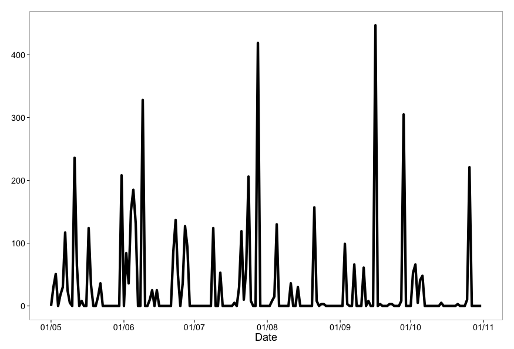
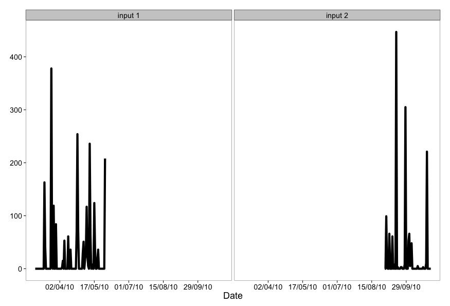

rnoaa
========

[](https://travis-ci.org/ropensci/rnoaa)

### Info


* We are using the NOAA API version 2. A previous version of this software was using their V1 API - older versions of this software use the old API - let us know if you want to use that. 
* The docs for the API are [here](http://www.ncdc.noaa.gov/cdo-web/webservices/v2)
* GCHN Daily data is available [here](http://www.ncdc.noaa.gov/oa/climate/ghcn-daily/) via FTP and HTTP

### API key

You'll need an API key to use this package (essentially a password). Go [here](http://www.ncdc.noaa.gov/cdo-web/token) to get one. *You can't use this package without an API key.*

### Install from Github (not on CRAN yet)

```coffee
install.packages("devtools")
library(devtools)
install_github("rnoaa", "ropensci")
library(rnoaa)
```

### Quick start

####  Fetch list of city locations in descending order

```coffee
noaa_locs(locationcategoryid='CITY', sortfield='name', sortorder='desc')
```

```coffee
$atts
$atts$totalCount
[1] 1654

$atts$pageCount
[1] 25

$atts$offset
[1] 1


$data
              id                  name datacoverage    mindate    maxdate
1  CITY:NL000012            Zwolle, NL       1.0000 1892-08-01 2013-08-31
2  CITY:SZ000007            Zurich, SZ       1.0000 1901-01-01 2013-11-17
3  CITY:NG000004            Zinder, NG       0.8678 1906-01-01 1980-12-31
4  CITY:UP000025         Zhytomyra, UP       0.9725 1938-01-01 2013-11-17
5  CITY:KZ000017        Zhezkazgan, KZ       0.9275 1948-03-01 2013-11-17
6  CITY:CH000045         Zhengzhou, CH       1.0000 1951-01-01 2013-11-17
7  CITY:SP000021          Zaragoza, SP       1.0000 1941-01-01 2012-08-31
8  CITY:UP000024      Zaporiyhzhya, UP       0.9739 1936-01-01 2009-06-16
9  CITY:US390029     Zanesville, OH US       1.0000 1893-01-01 2013-11-19
10 CITY:LE000004             Zahle, LE       0.7811 1912-01-01 1971-12-31
11 CITY:IR000019           Zahedan, IR       0.9930 1951-01-01 2010-05-19
12 CITY:HR000002            Zagreb, HR       1.0000 1860-12-01 2008-12-31
13 CITY:RS000081 Yuzhno-Sakhalinsk, RS       1.0000 1947-01-01 2013-11-15
14 CITY:US040015           Yuma, AZ US       1.0000 1893-01-01 2013-11-19
15 CITY:US060048   Yucca Valley, CA US       1.0000 1942-02-01 2013-11-19
16 CITY:US060047      Yuba City, CA US       1.0000 1893-01-01 2013-11-19
17 CITY:US390028     Youngstown, OH US       1.0000 1893-01-01 2013-11-19
18 CITY:US420024           York, PA US       1.0000 1941-01-01 2013-11-19
19 CITY:US360031        Yonkers, NY US       1.0000 1876-01-01 2013-11-19
20 CITY:JA000017          Yokohama, JA       1.0000 1949-01-01 2013-11-17
21 CITY:CH000044          Yinchuan, CH       1.0000 1951-01-01 2013-11-17
22 CITY:AM000001           Yerevan, AM       0.9751 1885-06-01 2006-12-31
23 CITY:US280020     Yazoo City, MS US       1.0000 1948-01-01 2013-11-19
24 CITY:RS000080         Yaroslavl, RS       0.9850 1959-07-01 1987-05-20
25 CITY:US460009        Yankton, SD US       1.0000 1932-01-01 2013-11-19

attr(,"class")
[1] "noaa_locs"
```

#### Get info on a station by specifcying a dataset, locationtype, location, and station

```coffee
noaa_stations(datasetid='GHCND', locationid='FIPS:12017', stationid='GHCND:USC00084289')
```

```coffee
                 id                  name datacoverage    mindate    maxdate
1 GHCND:USC00084289 INVERNESS 3 SE, FL US            1 1899-02-01 2013-11-17
```

#### Search for data

```coffee
out <- noaa(datasetid='NORMAL_DLY', stationid='GHCND:USW00014895', datatypeid='dly-tmax-normal')
```

##### See a data.frame

```coffee
head( out$data )
```

```coffee
            station value attributes        datatype       date
1 GHCND:USW00014895   334          S DLY-TMAX-NORMAL 2010-01-01
2 GHCND:USW00014895   333          S DLY-TMAX-NORMAL 2010-01-02
3 GHCND:USW00014895   332          S DLY-TMAX-NORMAL 2010-01-03
4 GHCND:USW00014895   331          S DLY-TMAX-NORMAL 2010-01-04
5 GHCND:USW00014895   331          S DLY-TMAX-NORMAL 2010-01-05
6 GHCND:USW00014895   330          S DLY-TMAX-NORMAL 2010-01-06
```

#### Plot data, super simple, but it's a start

```coffee
out <- noaa(datasetid='GHCND', stationid='GHCND:USW00014895', datatypeid='PRCP', startdate = '2010-05-01', enddate = '2010-10-31', limit=500)
noaa_plot(out, breaks="1 month", dateformat="%d/%m")
```



#### More plotting

You can pass many outputs from calls to the `noaa` function in to the `noaa_plot` function.

```coffee
out1 <- noaa(datasetid='GHCND', stationid='GHCND:USW00014895', datatypeid='PRCP', startdate = '2010-03-01', enddate = '2010-05-31', limit=500)
out2 <- noaa(datasetid='GHCND', stationid='GHCND:USW00014895', datatypeid='PRCP', startdate = '2010-09-01', enddate = '2010-10-31', limit=500)
noaa_plot(out1, out2, breaks="45 days")
```



### Get table of all datasets

```coffee
noaa_datasets()
```

```coffee
$data
           id                    name datacoverage    mindate    maxdate
1      ANNUAL        Annual Summaries         1.00 1831-02-01 2012-11-01
2       GHCND         Daily Summaries         1.00 1763-01-01 2013-11-19
3     GHCNDMS       Monthly Summaries         1.00 1763-01-01 2013-10-01
4     NEXRAD2         Nexrad Level II         0.95 1991-06-05 2013-11-19
5     NEXRAD3        Nexrad Level III         0.95 1994-05-20 2013-11-17
6  NORMAL_ANN Normals Annual/Seasonal         1.00 2010-01-01 2010-01-01
7  NORMAL_DLY           Normals Daily         1.00 2010-01-01 2010-12-31
8  NORMAL_HLY          Normals Hourly         1.00 2010-01-01 2010-12-31
9  NORMAL_MLY         Normals Monthly         1.00 2010-01-01 2010-12-01
10  PRECIP_15 Precipitation 15 Minute         0.25 1970-05-12 2013-03-01
11 PRECIP_HLY    Precipitation Hourly         1.00 1900-01-01 2013-03-01

$metadata
  limit count offset
1    25    11      1

attr(,"class")
[1] "noaa_datasets"
```

### Get data category data and metadata

```coffee
noaa_datacats(locationid='CITY:US390029')
```

```coffee
$atts
$atts$totalCount
[1] 37

$atts$pageCount
[1] 25

$atts$offset
[1] 1


$data
              id                  name
1         ANNAGR   Annual Agricultural
2          ANNDD    Annual Degree Days
3        ANNPRCP  Annual Precipitation
4        ANNTEMP    Annual Temperature
5          AUAGR   Autumn Agricultural
6           AUDD    Autumn Degree Days
7         AUPRCP  Autumn Precipitation
8         AUTEMP    Autumn Temperature
9           COMP              Computed
10       COMPAGR Computed Agricultural
11            DD           Degree Days
12 DUALPOLMOMENT      Dual-Pol Moments
13       ECHOTOP             Echo Tops
14   HYDROMETEOR      Hydrometeor Type
15         OTHER                 Other
16       OVERLAY               Overlay
17          PRCP         Precipitation
18  REFLECTIVITY          Reflectivity
19           SKY    Sky cover & clouds
20         SPAGR   Spring Agricultural
21          SPDD    Spring Degree Days
22        SPPRCP  Spring Precipitation
23        SPTEMP    Spring Temperature
24         SUAGR   Summer Agricultural
25          SUDD    Summer Degree Days

attr(,"class")
[1] "noaa_datacats"
```

[Please report any issues or bugs](https://github.com/ropensci/rnoaa/issues).

License: CC0

This package is part of the [rOpenSci](http://ropensci.org/packages) project.

To cite package `rnoaa` in publications use:

```coffee
  Hart Ted, Scott Chamberlain and Karthik Ram (2013). rnoaa: NOAA
  climate data from R.. R package version 0.0.8.
  https://github.com/ropensci/rnoaa

A BibTeX entry for LaTeX users is

  @Manual{,
    title = {rnoaa: NOAA climate data from R.},
    author = {Hart Ted and Scott Chamberlain and Karthik Ram},
    year = {2013},
    note = {R package version 0.0.8},
    url = {https://github.com/ropensci/rnoaa},
  }
```

Get citation information for `rnoaa` in R doing `citation(package = 'rnoaa')`

[](http://ropensci.org)