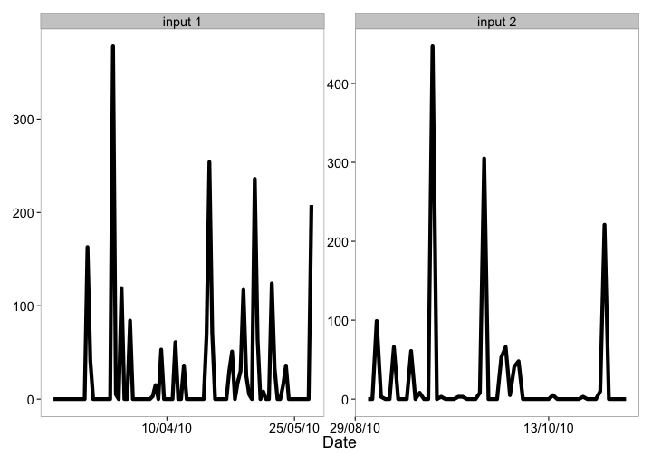
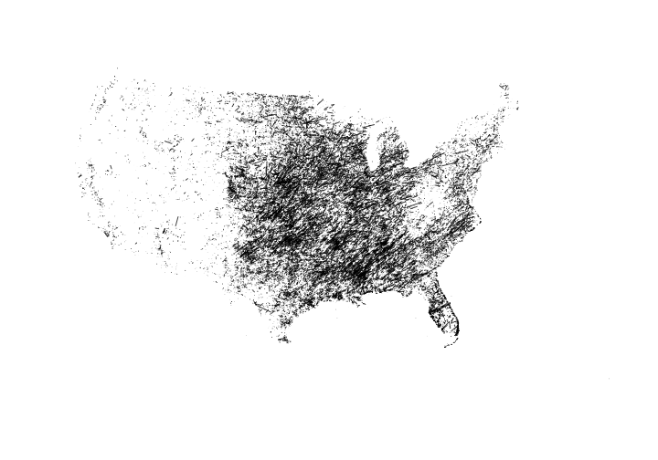

rnoaa
=====


[](https://travis-ci.org/ropensci/rnoaa)
[](https://ci.appveyor.com/project/sckott/rnoaa/branch/master)

## IMPORTANT - BUOY DATA

NOAA buoy data requires an R pacakage `ncdf4` that is difficult to use on Windows. Therefore, we have moved functions for working with buoy data into a separate branch called `buoy`, and the `CRAN` version does not include buoy functions. Thus, if you're on a Linux machine or on OSX you should be able to use the `buoy` branch just fine after installing the `netcdf` as:

OSX

```
brew install netcdf
```

Linux (Ubuntu)

```
sudo apt-get install netcdf*
```

Then `rnoaa` with the buoy functions should install and load correctly. See [this stackoverflow post](http://stackoverflow.com/questions/22805123/netcdf-make-command-test/22806048#22806048) and [this blog post](http://mazamascience.com/WorkingWithData/?p=1429) for more Linux/OSX `netcdf` installation help.

## Help

There is a tutorial on the [rOpenSci website](http://ropensci.org/tutorials/rncdc_tutorial.html), and there are many tutorials in the package itself, available in your R session, or [on CRAN](http://cran.r-project.org/web/packages/rnoaa/index.html). The tutorials:

* NOAA Buoy vignette
* NOAA ERDDAP vignette
* NOAA National Climatic Data Center (NCDC) vignette (examples)
* NOAA NCDC attributes vignette
* NOAA NCDC workflow vignette
* Sea ice vignette
* Severe Weather Data Inventory (SWDI) vignette
* Historical Observing Metadata Repository (HOMR) vignette
* Storms (IBTrACS) vignette

## Data sources used in rnoaa

The majority of functions in this package work with NOAA NCDC data.

* NOAA NCDC climate data:
    * We are using the NOAA API version 2. A previous version of this software was using their V1 API - older versions of this software use the old API - let us know if you want to use that.
    * The docs for the NCDC data API are [here](http://www.ncdc.noaa.gov/cdo-web/webservices/v2)
    * GHCN Daily data is available [here](http://www.ncdc.noaa.gov/oa/climate/ghcn-daily/) via FTP and HTTP
* Severe weather data docs are [here](http://www.ncdc.noaa.gov/swdiws/)
* Sea ice data [ftp://sidads.colorado.edu/DATASETS/NOAA/G02135/shapefiles](ftp://sidads.colorado.edu/DATASETS/NOAA/G02135/shapefiles)
* NOAA buoy data [http://www.ndbc.noaa.gov/](http://www.ndbc.noaa.gov/)
* ERDDAP data [http://upwell.pfeg.noaa.gov/erddap/index.html](http://upwell.pfeg.noaa.gov/erddap/index.html)
  * griddap - gridded data
  * tabledap - tablular data
* Tornadoes! Data from the NOAA Storm Prediction Center [http://www.spc.noaa.gov/gis/svrgis/]()
* HOMR - Historical Observing Metadata Repository - from the NOAA NCDC  [http://www.ncdc.noaa.gov/homr/api]()
* Storm data - from the International Best Track Archive for Climate Stewardship (IBTrACS)   [http://www.ncdc.noaa.gov/ibtracs/index.php?name=wmo-data]()

## NOAA NCDC Datasets

There are many NOAA NCDC datasets. All data sources work, except `NEXRAD2` and `NEXRAD3`, for an unkown reason.

| Dataset | Description | Start date | End date |
|---------|-------------|------------|----------|
| ANNUAL | Annual Summaries | 1831-02-01 | 2013-11-01 |
| GHCND | Daily Summaries | 1763-01-01 | 2014-03-15 |
| GHCNDMS | Monthly Summaries | 1763-01-01 | 2014-01-01 |
| NORMAL_ANN | Normals Annual/Seasonal | 2010-01-01 | 2010-01-01 |
| NORMAL_DLY | Normals Daily | 2010-01-01 | 2010-12-31 |
| NORMAL_HLY | Normals Hourly | 2010-01-01 | 2010-12-31 |
| NORMAL_MLY | Normals Monthly | 2010-01-01 | 2010-12-01 |
| PRECIP_15 | Precipitation 15 Minute | 1970-05-12 | 2013-03-01 |
| PRECIP_HLY | Precipitation Hourly | 1900-01-01 | 2013-03-01 |
| NEXRAD2 | Nexrad Level II | 1991-06-05 | 2014-03-14 |
| NEXRAD3 | Nexrad Level III | 1994-05-20 | 2014-03-11 |

## NOAA NCDC Attributes

Each NOAA dataset has a different set of attributes that you can potentially get back in your search. See [the NOAA docs](http://www.ncdc.noaa.gov/cdo-web/datasets) for detailed info on each dataset. We provide some information on the attributes in this package; see the [vignette for attributes](inst/vign/rncdc_attributes.md) to find out more

## Authentication

You'll need an API key to use the NOAA NCDC functions (those starting with `ncdc*()`) in this package (essentially a password). Go [here](http://www.ncdc.noaa.gov/cdo-web/token) to get one. *You can't use this package without an API key.*

Once you obtain a key, there are two ways to use it.

a) Pass it inline with each function call (somewhat cumbersome)  


```r
ncdc(datasetid = 'PRECIP_HLY', locationid = 'ZIP:28801', datatypeid = 'HPCP', limit = 5, token =  "YOUR_TOKEN")
```

b) Alternatively, you might find it easier to set this as an option, either by adding this line to the top of a script or somewhere in your `.rprofile`


```r
options(noaakey = "KEY_EMAILED_TO_YOU")
```

c) You can always store in permamently in your `.Rprofile` file.


## Installation

__GDAL__

You'll need [GDAL](http://www.gdal.org/) installed first. You may want to use GDAL >= `0.9-1` since that version or later can read TopoJSON format files as well, which aren't required here, but may be useful. Install GDAL:

* OSX - From http://www.kyngchaos.com/software/frameworks
* Linux - run `sudo apt-get install gdal-bin` [reference](https://www.mapbox.com/tilemill/docs/guides/gdal/#linux)
* Windows - From http://trac.osgeo.org/osgeo4w/

Then when you install the R package `rgdal` (`rgeos` also requires GDAL), you'll most likely need to specify where you're `gdal-config` file is on your machine, as well as a few other things. I have an OSX Mavericks machine, and this works for me (there's no binary for Mavericks, so install the source version):


```r
install.packages("http://cran.r-project.org/src/contrib/rgdal_0.9-1.tar.gz", repos = NULL, type="source", configure.args = "--with-gdal-config=/Library/Frameworks/GDAL.framework/Versions/1.10/unix/bin/gdal-config --with-proj-include=/Library/Frameworks/PROJ.framework/unix/include --with-proj-lib=/Library/Frameworks/PROJ.framework/unix/lib")
```

The rest of the installation should be easy. If not, let us know.

__Stable version from CRAN__


```r
install.packages("rnoaa")
```

__or development version from GitHub__


```r
install.packages("devtools")
devtools::install_github("ropensci/rnoaa")
library('rnoaa')
```

__or version with buoy functions on Github__


```r
install.packages("devtools")
devtools::install_github("ropensci/rnoaa", ref="buoy")
```


```r
library('rnoaa')
```

## NCDC v2 API data

###  Fetch list of city locations in descending order


```r
ncdc_locs(locationcategoryid='CITY', sortfield='name', sortorder='desc')
#> $meta
#> $meta$totalCount
#> [1] 1656
#> 
#> $meta$pageCount
#> [1] 25
#> 
#> $meta$offset
#> [1] 1
#> 
#> 
#> $data
#>               id                  name datacoverage    mindate    maxdate
#> 1  CITY:NL000012            Zwolle, NL       1.0000 1892-08-01 2014-11-30
#> 2  CITY:SZ000007            Zurich, SZ       1.0000 1901-01-01 2014-12-16
#> 3  CITY:NG000004            Zinder, NG       0.8678 1906-01-01 1980-12-31
#> 4  CITY:UP000025         Zhytomyra, UP       0.9729 1938-01-01 2014-12-16
#> 5  CITY:KZ000017        Zhezkazgan, KZ       0.9288 1948-03-01 2014-12-16
#> 6  CITY:CH000045         Zhengzhou, CH       1.0000 1951-01-01 2014-12-16
#> 7  CITY:SP000021          Zaragoza, SP       1.0000 1941-01-01 2012-08-31
#> 8  CITY:UP000024      Zaporiyhzhya, UP       0.9739 1936-01-01 2009-06-16
#> 9  CITY:US390029     Zanesville, OH US       1.0000 1893-01-01 2014-12-18
#> 10 CITY:LE000004             Zahle, LE       0.7811 1912-01-01 1971-12-31
#> 11 CITY:IR000019           Zahedan, IR       0.9930 1951-01-01 2010-05-19
#> 12 CITY:HR000002            Zagreb, HR       1.0000 1860-12-01 2013-12-31
#> 13 CITY:RS000081 Yuzhno-Sakhalinsk, RS       1.0000 1947-01-01 2014-12-16
#> 14 CITY:US040015           Yuma, AZ US       1.0000 1893-01-01 2014-12-18
#> 15 CITY:US060048   Yucca Valley, CA US       1.0000 1942-02-01 2014-12-18
#> 16 CITY:US060047      Yuba City, CA US       1.0000 1893-01-01 2014-12-18
#> 17 CITY:US390028     Youngstown, OH US       1.0000 1893-01-01 2014-12-18
#> 18 CITY:US420024           York, PA US       1.0000 1941-01-01 2014-12-18
#> 19 CITY:US360031        Yonkers, NY US       1.0000 1876-01-01 2014-12-18
#> 20 CITY:JA000017          Yokohama, JA       1.0000 1949-01-01 2014-12-16
#> 21 CITY:CH000044          Yinchuan, CH       1.0000 1951-01-01 2014-12-16
#> 22 CITY:AM000001           Yerevan, AM       0.9751 1885-06-01 2014-12-16
#> 23 CITY:US280020     Yazoo City, MS US       1.0000 1948-01-01 2014-12-18
#> 24 CITY:RS000080         Yaroslavl, RS       0.9850 1959-07-01 1987-05-20
#> 25 CITY:US460009        Yankton, SD US       1.0000 1932-01-01 2014-12-18
#> 
#> attr(,"class")
#> [1] "ncdc_locs"
```

### Get info on a station by specifcying a dataset, locationtype, location, and station


```r
ncdc_stations(datasetid='GHCND', locationid='FIPS:12017', stationid='GHCND:USC00084289')
#> $meta
#> NULL
#> 
#> $data
#>                  id elevation                  name elevationUnit
#> 1 GHCND:USC00084289      12.2 INVERNESS 3 SE, FL US        METERS
#>   datacoverage longitude    mindate latitude    maxdate
#> 1            1  -82.3126 1899-02-01  28.8029 2014-12-17
#> 
#> attr(,"class")
#> [1] "ncdc_stations"
```


### Search for data


```r
out <- ncdc(datasetid='NORMAL_DLY', stationid='GHCND:USW00014895', datatypeid='dly-tmax-normal', startdate = '2010-05-01', enddate = '2010-05-10')
```

### See a data.frame


```r
head( out$data )
#>             station value        datatype                date fl_c
#> 1 GHCND:USW00014895   652 DLY-TMAX-NORMAL 2010-05-01T00:00:00    S
#> 2 GHCND:USW00014895   655 DLY-TMAX-NORMAL 2010-05-02T00:00:00    S
#> 3 GHCND:USW00014895   658 DLY-TMAX-NORMAL 2010-05-03T00:00:00    S
#> 4 GHCND:USW00014895   661 DLY-TMAX-NORMAL 2010-05-04T00:00:00    S
#> 5 GHCND:USW00014895   663 DLY-TMAX-NORMAL 2010-05-05T00:00:00    S
#> 6 GHCND:USW00014895   666 DLY-TMAX-NORMAL 2010-05-06T00:00:00    S
```

### Plot data, super simple, but it's a start


```r
out <- ncdc(datasetid='GHCND', stationid='GHCND:USW00014895', datatypeid='PRCP', startdate = '2010-05-01', enddate = '2010-10-31', limit=500)
ncdc_plot(out, breaks="1 month", dateformat="%d/%m")
```

 

### More plotting

You can pass many outputs from calls to the `noaa` function in to the `ncdc_plot` function.


```r
out1 <- ncdc(datasetid='GHCND', stationid='GHCND:USW00014895', datatypeid='PRCP', startdate = '2010-03-01', enddate = '2010-05-31', limit=500)
out2 <- ncdc(datasetid='GHCND', stationid='GHCND:USW00014895', datatypeid='PRCP', startdate = '2010-09-01', enddate = '2010-10-31', limit=500)
ncdc_plot(out1, out2, breaks="45 days")
```

 

### Get table of all datasets


```r
ncdc_datasets()
#> $meta
#> $meta$limit
#> [1] 25
#> 
#> $meta$count
#> [1] 11
#> 
#> $meta$offset
#> [1] 1
#> 
#> 
#> $data
#>                     uid         id                      name datacoverage
#> 1  gov.noaa.ncdc:C00040     ANNUAL          Annual Summaries         1.00
#> 2  gov.noaa.ncdc:C00861      GHCND           Daily Summaries         1.00
#> 3  gov.noaa.ncdc:C00841    GHCNDMS         Monthly Summaries         1.00
#> 4  gov.noaa.ncdc:C00345    NEXRAD2  Weather Radar (Level II)         0.95
#> 5  gov.noaa.ncdc:C00708    NEXRAD3 Weather Radar (Level III)         0.95
#> 6  gov.noaa.ncdc:C00821 NORMAL_ANN   Normals Annual/Seasonal         1.00
#> 7  gov.noaa.ncdc:C00823 NORMAL_DLY             Normals Daily         1.00
#> 8  gov.noaa.ncdc:C00824 NORMAL_HLY            Normals Hourly         1.00
#> 9  gov.noaa.ncdc:C00822 NORMAL_MLY           Normals Monthly         1.00
#> 10 gov.noaa.ncdc:C00505  PRECIP_15   Precipitation 15 Minute         0.25
#> 11 gov.noaa.ncdc:C00313 PRECIP_HLY      Precipitation Hourly         1.00
#>       mindate    maxdate
#> 1  1831-02-01 2014-07-01
#> 2  1763-01-01 2014-12-18
#> 3  1763-01-01 2014-11-01
#> 4  1991-06-05 2014-12-18
#> 5  1994-05-20 2014-12-14
#> 6  2010-01-01 2010-01-01
#> 7  2010-01-01 2010-12-31
#> 8  2010-01-01 2010-12-31
#> 9  2010-01-01 2010-12-01
#> 10 1970-05-12 2013-07-01
#> 11 1900-01-01 2013-10-01
#> 
#> attr(,"class")
#> [1] "ncdc_datasets"
```

### Get data category data and metadata


```r
ncdc_datacats(locationid='CITY:US390029')
#> $meta
#> $meta$totalCount
#> [1] 37
#> 
#> $meta$pageCount
#> [1] 25
#> 
#> $meta$offset
#> [1] 1
#> 
#> 
#> $data
#>               id                  name
#> 1         ANNAGR   Annual Agricultural
#> 2          ANNDD    Annual Degree Days
#> 3        ANNPRCP  Annual Precipitation
#> 4        ANNTEMP    Annual Temperature
#> 5          AUAGR   Autumn Agricultural
#> 6           AUDD    Autumn Degree Days
#> 7         AUPRCP  Autumn Precipitation
#> 8         AUTEMP    Autumn Temperature
#> 9           COMP              Computed
#> 10       COMPAGR Computed Agricultural
#> 11            DD           Degree Days
#> 12 DUALPOLMOMENT      Dual-Pol Moments
#> 13       ECHOTOP             Echo Tops
#> 14   HYDROMETEOR      Hydrometeor Type
#> 15         OTHER                 Other
#> 16       OVERLAY               Overlay
#> 17          PRCP         Precipitation
#> 18  REFLECTIVITY          Reflectivity
#> 19           SKY    Sky cover & clouds
#> 20         SPAGR   Spring Agricultural
#> 21          SPDD    Spring Degree Days
#> 22        SPPRCP  Spring Precipitation
#> 23        SPTEMP    Spring Temperature
#> 24         SUAGR   Summer Agricultural
#> 25          SUDD    Summer Degree Days
#> 
#> attr(,"class")
#> [1] "ncdc_datacats"
```

## Tornado data

The function `tornadoes()` simply gets __all the data__. So the call takes a while, but once done, is fun to play with.


```r
shp <- tornadoes()
#> OGR data source with driver: ESRI Shapefile 
#> Source: "/Users/sacmac/.rnoaa/tornadoes/tornadoes", layer: "tornado"
#> with 57988 features and 21 fields
#> Feature type: wkbLineString with 2 dimensions
library('sp')
plot(shp)
```

 

## HOMR metadata

In this example, search for metadata for a single station ID


```r
homr(qid = 'COOP:046742')
#> $`20002078`
#> $`20002078`$id
#> [1] "20002078"
#> 
#> $`20002078`$head
#>                  preferredName latitude_dec longitude_dec precision
#> 1 PASO ROBLES MUNICIPAL AP, CA      35.6697     -120.6283    DDMMSS
#>             por.beginDate por.endDate
#> 1 1949-10-05T00:00:00.000     Present
#> 
#> $`20002078`$namez
#>                         name  nameType
#> 1   PASO ROBLES MUNICIPAL AP      COOP
#> 2   PASO ROBLES MUNICIPAL AP PRINCIPAL
#> 3 PASO ROBLES MUNICIPAL ARPT       PUB
#> 
#> $`20002078`$identifiers
#>      idType          id
#> 1     GHCND USW00093209
#> 2   GHCNMLT USW00093209
#> 3      COOP      046742
#> 4      WBAN       93209
#> 5       FAA         PRB
#> 6      ICAO        KPRB
#> 7     NWSLI         PRB
#> 8 NCDCSTNID    20002078
#> 
#> $`20002078`$status
#> NULL
#> 
#> $`20002078`$platform
#> [1] "COOP"
#> 
#> $`20002078`$relocations
#>   relocation                    date
#> 1 5.1 mi NNE 1949-10-05T00:00:00.000
#> 
#> $`20002078`$remarks
#>                         type
#> 1            NWS COOP INGEST
#> 2                    GENERAL
#> 3 RIVER BASIN (COOP NETWORK)
#>                                                                                                                                                                                                                                                                                remark
#> 1                                                                                                                                                                          REQUIRED 5 YEAR UPDATE\r\nASOS COMMISSIONED 01/18/2001\r\nSERVICE LEVEL "D" ASOS MAINTAINED BY LOX NWS ETS
#> 2 PHOTOS ADDED FOR ASOS EXPOSURE DOCUMENTATION EFFORT (CIRCA 1999+) WHICH TOOK PHOTOS OF THE AREA SURROUNDING COASTAL AND INLAND ASOS SITES IN AREAS SUBJECT TO HURRICANES. THE PHOTOS HELP DOCUMENT STATION EXPOSURE AND IDENTIFY OBSTACLES THAT COULD REDUCE THE WINDS AT THE SITE.
#> 3                                                                                                                                                                                                                                                                             SALINAS
#> 
#> $`20002078`$updates
#>             effectiveDate    providedBy updateSource version
#> 1 2014-08-14T00:00:00.000 NCDC\\KTHOMAS       AD HOC    NONE
#>                                                                                       description
#> 1 ADDING ANEMOMETER HEIGHTS FROM NWS SURFACE OBSERVATIONS PROGRAM LISTING DATED FEBRUARY 11, 2009
#>   enteredBy               enteredDate modifiedBy              modifiedDate
#> 1   KTHOMAS 2014-08-14T10:07:52-04:00   SMCNEILL 2014-09-24T14:56:23-04:00
#> 
#> $`20002078`$elements
#>   dataProgram element frequency observationTime publishedFlag receiver
#> 1    COOP HPD  PRECIP    HOURLY            2400           HPD     NCDC
#> 2    COOP SOD  PRECIP     DAILY            2400            CD     NCDC
#> 3    COOP SOD    TEMP     DAILY            2400            CD     NCDC
#> 4    COOP SOD    WIND    HOURLY            UNKN          <NA>     <NA>
#>   reportingMethod equipment.equipment equipment.equipmentMods
#> 1             ADP                AHTB                RCRD;HTD
#> 2             ADP               PCPNX                    <NA>
#> 3             ADP               TEMPX                    <NA>
#> 4            <NA>                <NA>                    <NA>
#>   equipment.equipmentAzimuth equipment.equipmentDistance
#> 1                        000                           0
#> 2                        000                           0
#> 3                        090                           4
#> 4                       <NA>                        <NA>
#>   equipment.equipmentDistanceUnits          date.beginDate date.endDate
#> 1                               ft 2010-02-11T00:00:00.000      Present
#> 2                               ft 2010-02-11T00:00:00.000      Present
#> 3                               ft 2010-02-11T00:00:00.000      Present
#> 4                             <NA> 2010-02-11T00:00:00.000      Present
#>   equipment
#> 1      <NA>
#> 2      <NA>
#> 3      <NA>
#> 4 ANEMSONIC
#> 
#> $`20002078`$location
#> $`20002078`$location$id
#> [1] "20002078"
#> 
#> $`20002078`$location$description
#>                                                                    description
#> 1 PASO ROBLES MUNICIPAL AIRPORT OUTSIDE AND 5 MILES NE OF PO AT PASO ROBLES CA
#> 
#> $`20002078`$location$latlon
#>   latitude_dec longitude_dec latitude_dms longitude_dms precision
#> 1      35.6697     -120.6283   35,40,11,N   120,37,42,W    DDMMSS
#>   datum_horiz           source
#> 1       NAD83 ASOS SITE SURVEY
#> 
#> $`20002078`$location$elevation
#>   elevationType elevationFeet elevationMeters groundElevDatum
#> 1        GROUND           810           246.9          NAVD88
#> 
#> $`20002078`$location$topography
#>                   description 
#> "LEVEL VALLEY LOCATION (S-N)" 
#> 
#> $`20002078`$location$obstructions
#>                   description
#> 1 HYGR 090/04 NO OBSTRUCTIONS
#> 
#> $`20002078`$location$geoinfo
#>   ncdstnId       country state          county utcoffset
#> 1 20002078 UNITED STATES    CA SAN LUIS OBISPO        -8
#> 
#> $`20002078`$location$nwsinfo
#>   ncdstnId climateDivisions.stateProvince climateDivisions.climateDivision
#> 1 20002078                             CA                               04
#>   climateDivisions.displayName nwsRegion nwsWfos.nwsWfo
#> 1       Central Coast Drainage   WESTERN            LOX
#>   nwsWfos.displayName
#> 1     LOS ANGELES, CA
#> 
#> 
#> 
#> attr(,"class")
#> [1] "homr"
#> attr(,"combined")
#> [1] FALSE
```

## Storm data

Get storm data for the year 2010


```r
storm_data(year=2010)
#> <NOAA Storm Data>
#> Size: 2855 X 195
#> 
#>       serial_num season num basin sub_basin name            iso_time
#> 1  2009317S10073   2010   1    SI        MM ANJA 2009-11-13 06:00:00
#> 2  2009317S10073   2010   1    SI        MM ANJA 2009-11-13 12:00:00
#> 3  2009317S10073   2010   1    SI        MM ANJA 2009-11-13 18:00:00
#> 4  2009317S10073   2010   1    SI        MM ANJA 2009-11-14 00:00:00
#> 5  2009317S10073   2010   1    SI        MM ANJA 2009-11-14 06:00:00
#> 6  2009317S10073   2010   1    SI        MM ANJA 2009-11-14 12:00:00
#> 7  2009317S10073   2010   1    SI        MM ANJA 2009-11-14 18:00:00
#> 8  2009317S10073   2010   1    SI        MM ANJA 2009-11-15 00:00:00
#> 9  2009317S10073   2010   1    SI        MM ANJA 2009-11-15 06:00:00
#> 10 2009317S10073   2010   1    SI        MM ANJA 2009-11-15 12:00:00
#> ..           ...    ... ...   ...       ...  ...                 ...
#> Variables not shown: nature (chr), latitude (dbl), longitude (dbl),
#>      wind.wmo. (dbl), pres.wmo. (dbl), center (chr), wind.wmo..percentile
#>      (dbl), pres.wmo..percentile (dbl), track_type (chr),
#>      latitude_for_mapping (dbl), longitude_for_mapping (dbl),
#>      current.basin (chr), hurdat_atl_lat (dbl), hurdat_atl_lon (dbl),
#>      hurdat_atl_grade (dbl), hurdat_atl_wind (dbl), hurdat_atl_pres (dbl),
#>      td9636_lat (dbl), td9636_lon (dbl), td9636_grade (dbl), td9636_wind
#>      (dbl), td9636_pres (dbl), reunion_lat (dbl), reunion_lon (dbl),
#>      reunion_grade (dbl), reunion_wind (dbl), reunion_pres (dbl), atcf_lat
#>      (dbl), atcf_lon (dbl), atcf_grade (dbl), atcf_wind (dbl), atcf_pres
#>      (dbl), ds824_sh_lat (dbl), ds824_sh_lon (dbl), ds824_sh_grade (dbl),
#>      ds824_sh_wind (dbl), ds824_sh_pres (dbl), ds824_ni_lat (dbl),
#>      ds824_ni_lon (dbl), ds824_ni_grade (dbl), ds824_ni_wind (dbl),
#>      ds824_ni_pres (dbl), bom_lat (dbl), bom_lon (dbl), bom_grade (dbl),
#>      bom_wind (dbl), bom_pres (dbl), ds824_au_lat (dbl), ds824_au_lon
#>      (dbl), ds824_au_grade (dbl), ds824_au_wind (dbl), ds824_au_pres
#>      (dbl), jtwc_sh_lat (dbl), jtwc_sh_lon (dbl), jtwc_sh_grade (dbl),
#>      jtwc_sh_wind (dbl), jtwc_sh_pres (dbl), jtwc_wp_lat (dbl),
#>      jtwc_wp_lon (dbl), jtwc_wp_grade (dbl), jtwc_wp_wind (dbl),
#>      jtwc_wp_pres (dbl), td9635_lat (dbl), td9635_lon (dbl), td9635_grade
#>      (dbl), td9635_wind (dbl), td9635_pres (dbl), ds824_wp_lat (dbl),
#>      ds824_wp_lon (dbl), ds824_wp_grade (dbl), ds824_wp_wind (dbl),
#>      ds824_wp_pres (dbl), jtwc_io_lat (dbl), jtwc_io_lon (dbl),
#>      jtwc_io_grade (dbl), jtwc_io_wind (dbl), jtwc_io_pres (dbl), cma_lat
#>      (dbl), cma_lon (dbl), cma_grade (dbl), cma_wind (dbl), cma_pres
#>      (dbl), hurdat_epa_lat (dbl), hurdat_epa_lon (dbl), hurdat_epa_grade
#>      (dbl), hurdat_epa_wind (dbl), hurdat_epa_pres (dbl), jtwc_ep_lat
#>      (dbl), jtwc_ep_lon (dbl), jtwc_ep_grade (dbl), jtwc_ep_wind (dbl),
#>      jtwc_ep_pres (dbl), ds824_ep_lat (dbl), ds824_ep_lon (dbl),
#>      ds824_ep_grade (dbl), ds824_ep_wind (dbl), ds824_ep_pres (dbl),
#>      jtwc_cp_lat (dbl), jtwc_cp_lon (dbl), jtwc_cp_grade (dbl),
#>      jtwc_cp_wind (dbl), jtwc_cp_pres (dbl), tokyo_lat (dbl), tokyo_lon
#>      (dbl), tokyo_grade (dbl), tokyo_wind (dbl), tokyo_pres (dbl),
#>      neumann_lat (dbl), neumann_lon (dbl), neumann_grade (dbl),
#>      neumann_wind (dbl), neumann_pres (dbl), hko_lat (dbl), hko_lon (dbl),
#>      hko_grade (dbl), hko_wind (dbl), hko_pres (dbl), cphc_lat (dbl),
#>      cphc_lon (dbl), cphc_grade (dbl), cphc_wind (dbl), cphc_pres (dbl),
#>      wellington_lat (dbl), wellington_lon (dbl), wellington_grade (dbl),
#>      wellington_wind (dbl), wellington_pres (dbl), newdelhi_lat (dbl),
#>      newdelhi_lon (dbl), newdelhi_grade (dbl), newdelhi_wind (dbl),
#>      newdelhi_pres (dbl), nadi_lat (dbl), nadi_lon (dbl), nadi_grade
#>      (dbl), nadi_wind (dbl), nadi_pres (dbl), reunion_rmw (dbl),
#>      reunion_wind_radii_1_ne (dbl), reunion_wind_radii_1_se (dbl),
#>      reunion_wind_radii_1_sw (dbl), reunion_wind_radii_1_nw (dbl),
#>      reunion_wind_radii_2_ne (dbl), reunion_wind_radii_2_se (dbl),
#>      reunion_wind_radii_2_sw (dbl), reunion_wind_radii_2_nw (dbl),
#>      bom_mn_hurr_xtnt (dbl), bom_mn_gale_xtnt (dbl), bom_mn_eye_diam
#>      (dbl), bom_roci (dbl), atcf_rmw (dbl), atcf_poci (dbl), atcf_roci
#>      (dbl), atcf_eye (dbl), atcf_wrad34_rad1 (dbl), atcf_wrad34_rad2
#>      (dbl), atcf_wrad34_rad3 (dbl), atcf_wrad34_rad4 (dbl),
#>      atcf_wrad50_rad1 (dbl), atcf_wrad50_rad2 (dbl), atcf_wrad50_rad3
#>      (dbl), atcf_wrad50_rad4 (dbl), atcf_wrad64_rad1 (dbl),
#>      atcf_wrad64_rad2 (dbl), atcf_wrad64_rad3 (dbl), atcf_wrad64_rad4
#>      (dbl), tokyo_dir50 (dbl), tokyo_long50 (dbl), tokyo_short50 (dbl),
#>      tokyo_dir30 (dbl), tokyo_long30 (dbl), tokyo_short30 (dbl),
#>      jtwc_.._rmw (dbl), jtwc_.._poci (dbl), jtwc_.._roci (dbl),
#>      jtwc_.._eye (dbl), jtwc_.._wrad34_rad1 (dbl), jtwc_.._wrad34_rad2
#>      (dbl), jtwc_.._wrad34_rad3 (dbl), jtwc_.._wrad34_rad4 (dbl),
#>      jtwc_.._wrad50_rad1 (dbl), jtwc_.._wrad50_rad2 (dbl),
#>      jtwc_.._wrad50_rad3 (dbl), jtwc_.._wrad50_rad4 (dbl),
#>      jtwc_.._wrad64_rad1 (dbl), jtwc_.._wrad64_rad2 (dbl),
#>      jtwc_.._wrad64_rad3 (dbl), jtwc_.._wrad64_rad4 (dbl)
```

## ERDDAP data

ERDDAP is a server built on top of OPenDAP, which serves some NOAA data. You can get gridded data ([griddap](http://upwell.pfeg.noaa.gov/erddap/griddap/documentation.html)), which lets you query from gridded datasets, or table data ([tabledap](http://upwell.pfeg.noaa.gov/erddap/tabledap/documentation.html)) which lets you query from tabular datasets. In terms of how we interface with them, there are similarties, but some differences too. We try to make a similar interface to both data types in `rnoaa`.

First, you likely want to search for data, specify either `griddadp` or `tabledap`


```r
erddap_search(query='size', which = "table")
#> 11 results, showing first 20 
#>                                                                                         title
#> 1                Channel Islands, Kelp Forest Monitoring, Size and Frequency, Natural Habitat
#> 2                                                                          CalCOFI Fish Sizes
#> 3                                                                        CalCOFI Larvae Sizes
#> 4                                                  OBIS - ARGOS Satellite Tracking of Animals
#> 5                                                     GLOBEC NEP MOCNESS Plankton (MOC1) Data
#> 6                                                 GLOBEC NEP Vertical Plankton Tow (VPT) Data
#> 7                             NWFSC Observer Fixed Gear Data, off West Coast of US, 2002-2006
#> 8                                  NWFSC Observer Trawl Data, off West Coast of US, 2002-2006
#> 9                                                         CalCOFI Larvae Counts Positive Tows
#> 10                                                                               CalCOFI Tows
#> 16 AN EXPERIMENTAL DATASET: Underway Sea Surface Temperature and Salinity Aboard the Oleander
#>             dataset_id
#> 1       erdCinpKfmSFNH
#> 2     erdCalCOFIfshsiz
#> 3     erdCalCOFIlrvsiz
#> 4            aadcArgos
#> 5        erdGlobecMoc1
#> 6         erdGlobecVpt
#> 7   nwioosObsFixed2002
#> 8   nwioosObsTrawl2002
#> 9  erdCalCOFIlrvcntpos
#> 10      erdCalCOFItows
#> 16            nodcPJJU
```


```r
erddap_search(query='size', which = "grid")
#> 5 results, showing first 20 
#>                                                            title
#> 11               NOAA Global Coral Bleaching Monitoring Products
#> 12            Coawst 4 use, Best Time Series [time][eta_u][xi_u]
#> 13            Coawst 4 use, Best Time Series [time][eta_v][xi_v]
#> 14 Coawst 4 use, Best Time Series [time][s_rho][eta_rho][xi_rho]
#> 15  Coawst 4 use, Best Time Series [time][Nbed][eta_rho][xi_rho]
#>               dataset_id
#> 11 hawaii_3b41_0c0b_72bc
#> 12   whoi_61c3_0b5d_cd61
#> 13   whoi_62d0_9d64_c8ff
#> 14   whoi_7dd7_db97_4bbe
#> 15   whoi_a4fb_2c9c_16a7
```

Then you can get information on a single dataset


```r
erddap_info('hawaii_3b41_0c0b_72bc')
#> <ERDDAP Dataset> hawaii_3b41_0c0b_72bc 
#>  Dimensions (range):  
#>      time: (2000-11-28T00:00:00Z, 2014-12-04T00:00:00Z) 
#>      latitude: (85.0, -80.0) 
#>      longitude: (-180.0, 179.5) 
#>  Variables:  
#>      CRW_DHW: 
#>          Units: Celsius weeks 
#>      CRW_HOTSPOT: 
#>          Units: Celsius 
#>      CRW_SST: 
#>          Units: Celsius 
#>      CRW_SSTANOMALY: 
#>          Units: Celsius
```

__griddap data__


```r
(out <- erddap_info('noaa_esrl_027d_0fb5_5d38'))
#> <ERDDAP Dataset> noaa_esrl_027d_0fb5_5d38 
#>  Dimensions (range):  
#>      time: (1850-01-01T00:00:00Z, 2014-05-01T00:00:00Z) 
#>      latitude: (87.5, -87.5) 
#>      longitude: (-177.5, 177.5) 
#>  Variables:  
#>      air: 
#>          Range: -20.9, 19.5 
#>          Units: degC
```


```r
(res <- erddap_grid(out,
  time = c('2012-01-01','2012-06-12'),
  latitude = c(21, 18),
  longitude = c(-80, -75)
))
#> <NOAA ERDDAP griddap> noaa_esrl_027d_0fb5_5d38
#>    Path: [/Users/sacmac/.rnoaa/erddap/noaa_esrl_027d_0fb5_5d38.csv]
#>    Last updated: [2014-11-04 10:36:20]
#>    File size:    [0 mb]
#>    Dimensions:   [24 X 4]
#> 
#>                    time latitude longitude  air
#> 1  2012-01-01T00:00:00Z     22.5     -77.5  NaN
#> 2  2012-01-01T00:00:00Z     22.5     -72.5  NaN
#> 3  2012-01-01T00:00:00Z     17.5     -77.5 -0.1
#> 4  2012-01-01T00:00:00Z     17.5     -72.5  NaN
#> 5  2012-02-01T00:00:00Z     22.5     -77.5  NaN
#> 6  2012-02-01T00:00:00Z     22.5     -72.5  NaN
#> 7  2012-02-01T00:00:00Z     17.5     -77.5  0.4
#> 8  2012-02-01T00:00:00Z     17.5     -72.5  NaN
#> 9  2012-03-01T00:00:00Z     22.5     -77.5  NaN
#> 10 2012-03-01T00:00:00Z     22.5     -72.5  NaN
#> ..                  ...      ...       ...  ...
```

__tabledap data__


```r
(out <- erddap_info('erdCalCOFIfshsiz'))
#> <ERDDAP Dataset> erdCalCOFIfshsiz 
#>  Variables:  
#>      calcofi_species_code: 
#>          Range: 19, 1550 
#>      common_name: 
#>      cruise: 
#>      fish_1000m3: 
#>          Units: Fish per 1,000 cubic meters of water sampled 
#>      fish_count: 
#>      fish_size: 
#>          Units: mm 
#>      itis_tsn: 
#>      latitude: 
#>          Range: 32.515, 38.502 
#>          Units: degrees_north 
#>      line: 
#>          Range: 46.6, 93.3 
#>      longitude: 
#>          Range: -128.5, -117.33 
#>          Units: degrees_east 
#>      net_location: 
#>      net_type: 
#>      order_occupied: 
#>      percent_sorted: 
#>          Units: %/100 
#>      sample_quality: 
#>      scientific_name: 
#>      ship: 
#>      ship_code: 
#>      standard_haul_factor: 
#>      station: 
#>          Range: 28.0, 114.9 
#>      time: 
#>          Range: 9.94464E8, 9.9510582E8 
#>          Units: seconds since 1970-01-01T00:00:00Z 
#>      tow_number: 
#>          Range: 2, 10 
#>      tow_type: 
#>      volume_sampled: 
#>          Units: cubic meters
```


```r
erddap_table(out, fields=c('longitude','latitude','fish_size','itis_tsn'),
    'time>=2001-07-07','time<=2001-07-10')
#> <NOAA ERDDAP tabledap> erdCalCOFIfshsiz
#>    Path: [~/.rnoaa/erddap/erdCalCOFIfshsiz.csv]
#>    Last updated: [2014-12-19 09:14:01]
#>    File size:    [0.02 mb]
#>    Dimensions:   [558 X 4]
#> 
#>     longitude  latitude fish_size itis_tsn
#> 2     -118.26    33.255      22.9   623745
#> 3     -118.26    33.255      22.9   623745
#> 4  -118.10667 32.738335      31.5   623625
#> 5  -118.10667 32.738335      48.3   623625
#> 6  -118.10667 32.738335      15.5   162221
#> 7  -118.10667 32.738335      16.3   162221
#> 8  -118.10667 32.738335      17.8   162221
#> 9  -118.10667 32.738335      18.2   162221
#> 10 -118.10667 32.738335      19.2   162221
#> 11 -118.10667 32.738335      20.0   162221
#> ..        ...       ...       ...      ...
```

## Meta

* [Please report any issues or bugs](https://github.com/ropensci/rnoaa/issues).
* License: MIT
* Get citation information for `rnoaa` in R doing `citation(package = 'rnoaa')`

[](http://ropensci.org)
