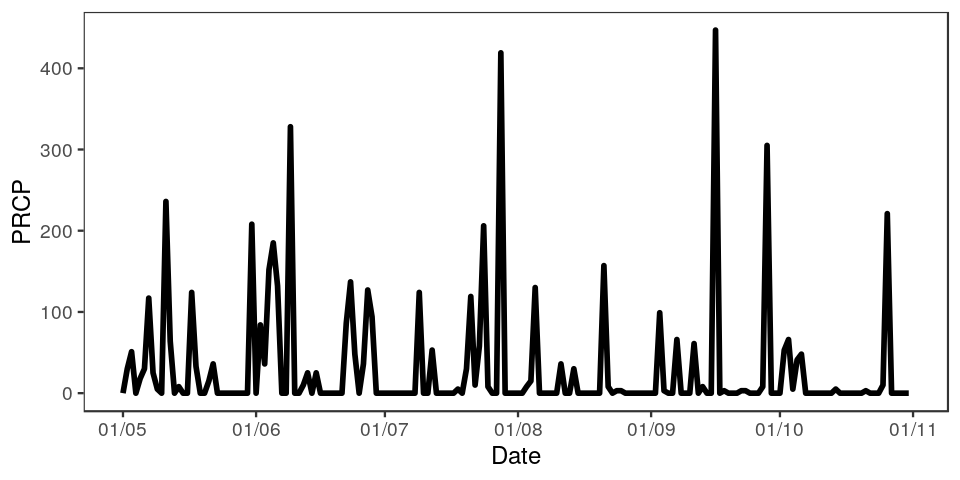
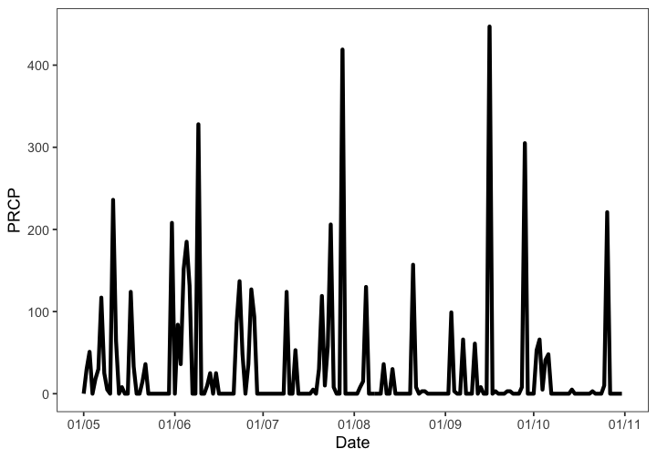
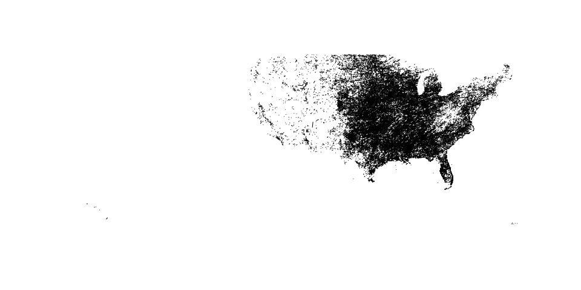

rnoaa
=====


[](https://travis-ci.org/ropensci/rnoaa)
[](https://ci.appveyor.com/project/sckott/rnoaa/branch/master)
[](https://codecov.io/github/ropensci/rnoaa?branch=master)
[](https://github.com/metacran/cranlogs.app)
[](https://cran.r-project.org/package=rnoaa)


`rnoaa` is an R interface to many NOAA data sources. We don't cover all of them, but we include many commonly used sources, and add we are always adding new sources. We focus on easy to use interfaces for getting NOAA data, and giving back data in easy to use formats downstream. We currently don't do much in the way of plots or analysis.

## Data sources in rnoaa

* NOAA NCDC climate data:
    * We are using the NOAA API version 2
    * Docs for the NCDC API are at http://www.ncdc.noaa.gov/cdo-web/webservices/v2
    * GHCN Daily data is available at http://www.ncdc.noaa.gov/oa/climate/ghcn-daily/ via FTP and HTTP
* Severe weather data docs are at http://www.ncdc.noaa.gov/swdiws/
* [Sea ice data](ftp://sidads.colorado.edu/DATASETS/NOAA/G02135/shapefiles)
* [NOAA buoy data](http://www.ndbc.noaa.gov/)
* [ERDDAP data](http://upwell.pfeg.noaa.gov/erddap/index.html)
  * Now in package [rerddap](https://github.com/ropensci/rerddap)
* Tornadoes! Data from the [NOAA Storm Prediction Center](http://www.spc.noaa.gov/gis/svrgis/)
* HOMR - Historical Observing Metadata Repository - from [NOAA NCDC](http://www.ncdc.noaa.gov/homr/api)
* Storm data - from the [International Best Track Archive for Climate Stewardship (IBTrACS)](http://www.ncdc.noaa.gov/ibtracs/index.php?name=wmo-data)
* [GHCND FTP data](ftp://ftp.ncdc.noaa.gov/pub/data/noaa) - NOAA NCDC API has some/all (not sure really) of this data, but FTP allows to get more data more quickly
* [Global Ensemble Forecast System (GEFS) data](https://www.ncdc.noaa.gov/data-access/model-data/model-datasets/global-ensemble-forecast-system-gefs)
* [Extended Reconstructed Sea Surface Temperature (ERSST) data](https://www.ncdc.noaa.gov/data-access/marineocean-data/extended-reconstructed-sea-surface-temperature-ersst-v4)
* [Argo buoys](http://www.argo.ucsd.edu/) - a global array of more than 3,000 free-drifting profiling floats that measures thetemperature and salinity of the upper 2000 m of the ocean
* [NOAA CO-OPS - tides and currents data](http://tidesandcurrents.noaa.gov/)
* [NOAA Climate Prediction Center (CPC)](http://www.cpc.ncep.noaa.gov/)
* [Africa Rainfall Climatology version 2](ftp://ftp.cpc.ncep.noaa.gov/fews/fewsdata/africa/arc2/ARC2_readme.txt)

## Help

There is a tutorial on the [rOpenSci website](http://ropensci.org/tutorials/rnoaa_tutorial.html), and there are many tutorials in the package itself, available in your R session, or [on CRAN](https://cran.r-project.org/package=rnoaa). The tutorials:

* NOAA Buoy vignette
* NOAA National Climatic Data Center (NCDC) vignette (examples)
* NOAA NCDC attributes vignette
* NOAA NCDC workflow vignette
* Sea ice vignette
* Severe Weather Data Inventory (SWDI) vignette
* Historical Observing Metadata Repository (HOMR) vignette
* Storms (IBTrACS) vignette

## netcdf data

Functions to work with buoy data use netcdf files. You'll need the `ncdf` package for those functions, and those only. `ncdf` is in Suggests in this package, meaning you only need `ncdf` if you are using the buoy functions. You'll get an informative error telling you to install `ncdf` if you don't have it and you try to use the buoy functions. Installation of `ncdf` should be straightforward on Mac and Windows, but on Linux you may have issues. See http://cran.r-project.org/web/packages/ncdf/INSTALL

## NOAA NCDC Datasets

There are many NOAA NCDC datasets. All data sources work, except `NEXRAD2` and `NEXRAD3`, for an unknown reason. This relates to `ncdc_*()` functions only.


|Dataset    |Description                 |Start Date |End Date   | Data Coverage|
|:----------|:---------------------------|:----------|:----------|-------------:|
|GHCND      |Daily Summaries             |1763-01-01 |2017-05-01 |          1.00|
|GSOM       |Global Summary of the Month |1763-01-01 |2017-04-01 |          1.00|
|GSOY       |Global Summary of the Year  |1763-01-01 |2016-01-01 |          1.00|
|NEXRAD2    |Weather Radar (Level II)    |1991-06-05 |2017-05-01 |          0.95|
|NEXRAD3    |Weather Radar (Level III)   |1994-05-20 |2017-04-07 |          0.95|
|NORMAL_ANN |Normals Annual/Seasonal     |2010-01-01 |2010-01-01 |          1.00|
|NORMAL_DLY |Normals Daily               |2010-01-01 |2010-12-31 |          1.00|
|NORMAL_HLY |Normals Hourly              |2010-01-01 |2010-12-31 |          1.00|
|NORMAL_MLY |Normals Monthly             |2010-01-01 |2010-12-01 |          1.00|
|PRECIP_15  |Precipitation 15 Minute     |1970-05-12 |2014-01-01 |          0.25|
|PRECIP_HLY |Precipitation Hourly        |1900-01-01 |2014-01-01 |          1.00|

## NOAA NCDC Attributes

Each NOAA dataset has a different set of attributes that you can potentially get back in your search. See http://www.ncdc.noaa.gov/cdo-web/datasets for detailed info on each dataset. We provide some information on the attributes in this package; see the [vignette for attributes](inst/vign/rncdc_attributes.md) to find out more

## NCDC Authentication

You'll need an API key to use the NOAA NCDC functions (those starting with `ncdc*()`) in this package (essentially a password). Go to http://www.ncdc.noaa.gov/cdo-web/token to get one. *You can't use this package without an API key.*

Once you obtain a key, there are two ways to use it.

a) Pass it inline with each function call (somewhat cumbersome)


```r
ncdc(datasetid = 'PRECIP_HLY', locationid = 'ZIP:28801', datatypeid = 'HPCP', limit = 5, token =  "YOUR_TOKEN")
```

b) Alternatively, you might find it easier to set this as an option, either by adding this line to the top of a script or somewhere in your `.rprofile`


```r
options(noaakey = "KEY_EMAILED_TO_YOU")
```

c) You can always store in permamently in your `.Rprofile` file.


## Installation

__GDAL__

You'll need [GDAL](http://www.gdal.org/) installed first. You may want to use GDAL >= `0.9-1` since that version or later can read TopoJSON format files as well, which aren't required here, but may be useful. Install GDAL:

* OSX - From http://www.kyngchaos.com/software/frameworks
* Linux - run `sudo apt-get install gdal-bin` [reference](https://www.mapbox.com/tilemill/docs/guides/gdal/#linux)
* Windows - From http://trac.osgeo.org/osgeo4w/

Then when you install the R package `rgdal` (`rgeos` also requires GDAL), you'll most likely need to specify where you're `gdal-config` file is on your machine, as well as a few other things. I have an OSX Mavericks machine, and this works for me (there's no binary for Mavericks, so install the source version):


```r
install.packages("http://cran.r-project.org/src/contrib/rgdal_0.9-1.tar.gz", repos = NULL, type="source", configure.args = "--with-gdal-config=/Library/Frameworks/GDAL.framework/Versions/1.10/unix/bin/gdal-config --with-proj-include=/Library/Frameworks/PROJ.framework/unix/include --with-proj-lib=/Library/Frameworks/PROJ.framework/unix/lib")
```

The rest of the installation should be easy. If not, let us know.

__Stable version from CRAN__


```r
install.packages("rnoaa")
```

__or development version from GitHub__


```r
devtools::install_github("ropensci/rnoaa")
```

__Load rnoaa__


```r
library('rnoaa')
```

## NCDC v2 API data

###  Fetch list of city locations in descending order


```r
ncdc_locs(locationcategoryid='CITY', sortfield='name', sortorder='desc')
#> $meta
#> $meta$totalCount
#> [1] 1980
#> 
#> $meta$pageCount
#> [1] 25
#> 
#> $meta$offset
#> [1] 1
#> 
#> 
#> $data
#>       mindate    maxdate                  name datacoverage            id
#> 1  1892-08-01 2017-03-31            Zwolle, NL       1.0000 CITY:NL000012
#> 2  1901-01-01 2017-04-29            Zurich, SZ       1.0000 CITY:SZ000007
#> 3  1957-07-01 2017-04-29         Zonguldak, TU       1.0000 CITY:TU000057
#> 4  1906-01-01 2017-04-29            Zinder, NG       0.9025 CITY:NG000004
#> 5  1973-01-01 2017-04-29        Ziguinchor, SG       1.0000 CITY:SG000004
#> 6  1938-01-01 2017-04-29         Zhytomyra, UP       0.9723 CITY:UP000025
#> 7  1948-03-01 2017-04-29        Zhezkazgan, KZ       0.9302 CITY:KZ000017
#> 8  1951-01-01 2017-04-29         Zhengzhou, CH       1.0000 CITY:CH000045
#> 9  1941-01-01 2017-03-31          Zaragoza, SP       1.0000 CITY:SP000021
#> 10 1936-01-01 2009-06-17      Zaporiyhzhya, UP       1.0000 CITY:UP000024
#> 11 1957-01-01 2017-04-29          Zanzibar, TZ       0.8016 CITY:TZ000019
#> 12 1973-01-01 2017-04-29            Zanjan, IR       0.9105 CITY:IR000020
#> 13 1893-01-01 2017-05-01     Zanesville, OH US       1.0000 CITY:US390029
#> 14 1912-01-01 2017-04-29             Zahle, LE       0.9819 CITY:LE000004
#> 15 1951-01-01 2017-04-29           Zahedan, IR       0.9975 CITY:IR000019
#> 16 1860-12-01 2017-04-29            Zagreb, HR       1.0000 CITY:HR000002
#> 17 1975-08-29 2017-04-29         Zacatecas, MX       0.9306 CITY:MX000036
#> 18 1947-01-01 2017-04-29 Yuzhno-Sakhalinsk, RS       1.0000 CITY:RS000081
#> 19 1893-01-01 2017-05-01           Yuma, AZ US       1.0000 CITY:US040015
#> 20 1942-02-01 2017-05-01   Yucca Valley, CA US       1.0000 CITY:US060048
#> 21 1885-01-01 2017-05-01      Yuba City, CA US       1.0000 CITY:US060047
#> 22 1998-02-01 2017-04-29            Yozgat, TU       1.0000 CITY:TU000056
#> 23 1893-01-01 2017-05-01     Youngstown, OH US       1.0000 CITY:US390028
#> 24 1894-01-01 2017-05-01           York, PA US       1.0000 CITY:US420024
#> 25 1869-01-01 2017-05-01        Yonkers, NY US       1.0000 CITY:US360031
#> 
#> attr(,"class")
#> [1] "ncdc_locs"
```

### Get info on a station by specifcying a dataset, locationtype, location, and station


```r
ncdc_stations(datasetid='GHCND', locationid='FIPS:12017', stationid='GHCND:USC00084289')
#> $meta
#> NULL
#> 
#> $data
#>   elevation    mindate    maxdate latitude                  name
#> 1      12.2 1899-02-01 2017-04-30  28.8029 INVERNESS 3 SE, FL US
#>   datacoverage                id elevationUnit longitude
#> 1            1 GHCND:USC00084289        METERS  -82.3126
#> 
#> attr(,"class")
#> [1] "ncdc_stations"
```


### Search for data


```r
out <- ncdc(datasetid='NORMAL_DLY', stationid='GHCND:USW00014895', datatypeid='dly-tmax-normal', startdate = '2010-05-01', enddate = '2010-05-10')
```

### See a data.frame


```r
head( out$data )
#>                  date        datatype           station value fl_c
#> 1 2010-05-01T00:00:00 DLY-TMAX-NORMAL GHCND:USW00014895   652    S
#> 2 2010-05-02T00:00:00 DLY-TMAX-NORMAL GHCND:USW00014895   655    S
#> 3 2010-05-03T00:00:00 DLY-TMAX-NORMAL GHCND:USW00014895   658    S
#> 4 2010-05-04T00:00:00 DLY-TMAX-NORMAL GHCND:USW00014895   661    S
#> 5 2010-05-05T00:00:00 DLY-TMAX-NORMAL GHCND:USW00014895   663    S
#> 6 2010-05-06T00:00:00 DLY-TMAX-NORMAL GHCND:USW00014895   666    S
```

### Plot data, super simple, but it's a start


```r
out <- ncdc(datasetid='GHCND', stationid='GHCND:USW00014895', datatypeid='PRCP', startdate = '2010-05-01', enddate = '2010-10-31', limit=500)
ncdc_plot(out, breaks="1 month", dateformat="%d/%m")
```



### More plotting

You can pass many outputs from calls to the `noaa` function in to the `ncdc_plot` function.


```r
out1 <- ncdc(datasetid='GHCND', stationid='GHCND:USW00014895', datatypeid='PRCP', startdate = '2010-03-01', enddate = '2010-05-31', limit=500)
out2 <- ncdc(datasetid='GHCND', stationid='GHCND:USW00014895', datatypeid='PRCP', startdate = '2010-09-01', enddate = '2010-10-31', limit=500)
ncdc_plot(out1, out2, breaks="45 days")
```



### Get table of all datasets


```r
ncdc_datasets()
#> $meta
#> $meta$offset
#> [1] 1
#> 
#> $meta$count
#> [1] 11
#> 
#> $meta$limit
#> [1] 25
#> 
#> 
#> $data
#>                     uid    mindate    maxdate                        name
#> 1  gov.noaa.ncdc:C00861 1763-01-01 2017-05-01             Daily Summaries
#> 2  gov.noaa.ncdc:C00946 1763-01-01 2017-04-01 Global Summary of the Month
#> 3  gov.noaa.ncdc:C00947 1763-01-01 2016-01-01  Global Summary of the Year
#> 4  gov.noaa.ncdc:C00345 1991-06-05 2017-05-01    Weather Radar (Level II)
#> 5  gov.noaa.ncdc:C00708 1994-05-20 2017-04-07   Weather Radar (Level III)
#> 6  gov.noaa.ncdc:C00821 2010-01-01 2010-01-01     Normals Annual/Seasonal
#> 7  gov.noaa.ncdc:C00823 2010-01-01 2010-12-31               Normals Daily
#> 8  gov.noaa.ncdc:C00824 2010-01-01 2010-12-31              Normals Hourly
#> 9  gov.noaa.ncdc:C00822 2010-01-01 2010-12-01             Normals Monthly
#> 10 gov.noaa.ncdc:C00505 1970-05-12 2014-01-01     Precipitation 15 Minute
#> 11 gov.noaa.ncdc:C00313 1900-01-01 2014-01-01        Precipitation Hourly
#>    datacoverage         id
#> 1          1.00      GHCND
#> 2          1.00       GSOM
#> 3          1.00       GSOY
#> 4          0.95    NEXRAD2
#> 5          0.95    NEXRAD3
#> 6          1.00 NORMAL_ANN
#> 7          1.00 NORMAL_DLY
#> 8          1.00 NORMAL_HLY
#> 9          1.00 NORMAL_MLY
#> 10         0.25  PRECIP_15
#> 11         1.00 PRECIP_HLY
#> 
#> attr(,"class")
#> [1] "ncdc_datasets"
```

### Get data category data and metadata


```r
ncdc_datacats(locationid = 'CITY:US390029')
#> $meta
#> $meta$totalCount
#> [1] 38
#> 
#> $meta$pageCount
#> [1] 25
#> 
#> $meta$offset
#> [1] 1
#> 
#> 
#> $data
#>                     name            id
#> 1    Annual Agricultural        ANNAGR
#> 2     Annual Degree Days         ANNDD
#> 3   Annual Precipitation       ANNPRCP
#> 4     Annual Temperature       ANNTEMP
#> 5    Autumn Agricultural         AUAGR
#> 6     Autumn Degree Days          AUDD
#> 7   Autumn Precipitation        AUPRCP
#> 8     Autumn Temperature        AUTEMP
#> 9               Computed          COMP
#> 10 Computed Agricultural       COMPAGR
#> 11           Degree Days            DD
#> 12      Dual-Pol Moments DUALPOLMOMENT
#> 13             Echo Tops       ECHOTOP
#> 14      Hydrometeor Type   HYDROMETEOR
#> 15            Miscellany          MISC
#> 16                 Other         OTHER
#> 17               Overlay       OVERLAY
#> 18         Precipitation          PRCP
#> 19          Reflectivity  REFLECTIVITY
#> 20    Sky cover & clouds           SKY
#> 21   Spring Agricultural         SPAGR
#> 22    Spring Degree Days          SPDD
#> 23  Spring Precipitation        SPPRCP
#> 24    Spring Temperature        SPTEMP
#> 25   Summer Agricultural         SUAGR
#> 
#> attr(,"class")
#> [1] "ncdc_datacats"
```

## Tornado data

The function `tornadoes()` simply gets __all the data__. So the call takes a while, but once done, is fun to play with.


```r
shp <- tornadoes()
#> OGR data source with driver: ESRI Shapefile 
#> Source: "/Users/sacmac/Library/Caches/rnoaa/tornadoes/torn", layer: "torn"
#> with 60114 features
#> It has 22 fields
#> Integer64 fields read as strings:  om yr mo dy tz stf stn mag inj fat wid fc
library('sp')
plot(shp)
```



## HOMR metadata

In this example, search for metadata for a single station ID


```r
homr(qid = 'COOP:046742')
#> $`20002078`
#> $`20002078`$id
#> [1] "20002078"
#> 
#> $`20002078`$head
#>                  preferredName latitude_dec longitude_dec precision
#> 1 PASO ROBLES MUNICIPAL AP, CA      35.6697     -120.6283   DDddddd
#>             por.beginDate por.endDate
#> 1 1949-10-05T00:00:00.000     Present
#> 
#> $`20002078`$namez
#>                         name  nameType
#> 1   PASO ROBLES MUNICIPAL AP      COOP
#> 2   PASO ROBLES MUNICIPAL AP PRINCIPAL
#> 3 PASO ROBLES MUNICIPAL ARPT       PUB
#> 
#> $`20002078`$identifiers
#>      idType          id
#> 1     GHCND USW00093209
#> 2   GHCNMLT USW00093209
...
```

## Storm data

Get storm data for the year 2010


```r
storm_data(year = 2010)
#> # A tibble: 2,855 × 195
#>       serial_num season   num basin sub_basin  name            iso_time
#>            <chr>  <int> <int> <chr>     <chr> <chr>               <chr>
#> 1  2009317S10073   2010     1    SI        MM  ANJA 2009-11-13 06:00:00
#> 2  2009317S10073   2010     1    SI        MM  ANJA 2009-11-13 12:00:00
#> 3  2009317S10073   2010     1    SI        MM  ANJA 2009-11-13 18:00:00
#> 4  2009317S10073   2010     1    SI        MM  ANJA 2009-11-14 00:00:00
#> 5  2009317S10073   2010     1    SI        MM  ANJA 2009-11-14 06:00:00
#> 6  2009317S10073   2010     1    SI        MM  ANJA 2009-11-14 12:00:00
#> 7  2009317S10073   2010     1    SI        MM  ANJA 2009-11-14 18:00:00
#> 8  2009317S10073   2010     1    SI        MM  ANJA 2009-11-15 00:00:00
#> 9  2009317S10073   2010     1    SI        MM  ANJA 2009-11-15 06:00:00
#> 10 2009317S10073   2010     1    SI        MM  ANJA 2009-11-15 12:00:00
#> # ... with 2,845 more rows, and 188 more variables: nature <chr>,
#> #   latitude <dbl>, longitude <dbl>, wind.wmo. <dbl>, pres.wmo. <dbl>,
#> #   center <chr>, wind.wmo..percentile <dbl>, pres.wmo..percentile <dbl>,
#> #   track_type <chr>, latitude_for_mapping <dbl>,
#> #   longitude_for_mapping <dbl>, current.basin <chr>,
#> #   hurdat_atl_lat <dbl>, hurdat_atl_lon <dbl>, hurdat_atl_grade <dbl>,
#> #   hurdat_atl_wind <dbl>, hurdat_atl_pres <dbl>, td9636_lat <dbl>,
...
```

## GEFS data

Get forecast for a certain variable.


```r
res <- gefs("Total_precipitation_surface_6_Hour_Accumulation_ens", lat = 46.28125, lon = -116.2188)
head(res$data)
#>   Total_precipitation_surface_6_Hour_Accumulation_ens lon lat ens time2
#> 1                                                   0 244  46   0     6
#> 2                                                   0 244  46   1    12
#> 3                                                   0 244  46   2    18
#> 4                                                   0 244  46   3    24
#> 5                                                   0 244  46   4    30
#> 6                                                   0 244  46   5    36
```

## Argo buoys data

There are a suite of functions for Argo data, a few egs:


```r
# Spatial search - by bounding box
argo_search("coord", box = c(-40, 35, 3, 2))

# Time based search
argo_search("coord", yearmin = 2007, yearmax = 2009)

# Data quality based search
argo_search("coord", pres_qc = "A", temp_qc = "A")

# Search on partial float id number
argo_qwmo(qwmo = 49)

# Get data
argo(dac = "meds", id = 4900881, cycle = 127, dtype = "D")
```

## CO-OPS data

Get daily mean water level data at Fairport, OH (9063053)


```r
coops_search(station_name = 9063053, begin_date = 20150927, end_date = 20150928,
             product = "daily_mean", datum = "stnd", time_zone = "lst")
#> $metadata
#> $metadata$id
#> [1] "9063053"
#> 
#> $metadata$name
#> [1] "Fairport"
#> 
#> $metadata$lat
#> [1] "41.7598"
#> 
#> $metadata$lon
#> [1] "-81.2811"
#> 
#> 
#> $data
#>            t       v   f
#> 1 2015-09-27 174.430 0,0
#> 2 2015-09-28 174.422 0,0
```

## Contributors

* [Scott Chamberlain](https://github.com/sckott)
* [Brooke Anderson](https://github.com/geanders)
* [Maëlle Salmon](https://github.com/maelle)
* [Adam Erickson](https://github.com/adam-erickson)
* [Nicholas Potter](https://github.com/potterzot)
* [Joseph Stachelek](https://github.com/jsta)

## Meta

* Please [report any issues or bugs](https://github.com/ropensci/rnoaa/issues).
* License: MIT
* Get citation information for `rnoaa` in R doing `citation(package = 'rnoaa')`
* Please note that this project is released with a [Contributor Code of Conduct](CONDUCT.md). By participating in this project you agree to abide by its terms.

[](https://ropensci.org)
