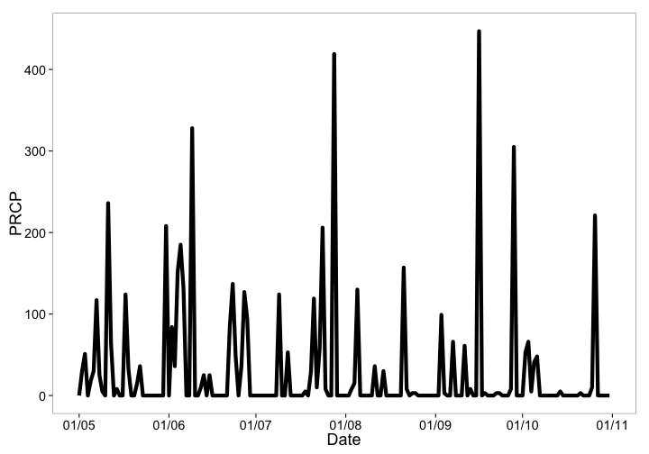
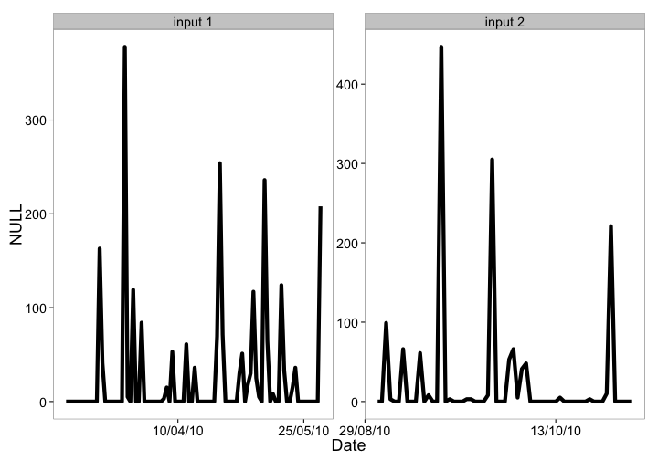

rnoaa
=====


[](https://travis-ci.org/ropensci/rnoaa)
[](https://ci.appveyor.com/project/sckott/rnoaa/branch/master)
[](https://codecov.io/github/ropensci/rnoaa?branch=master)
[](https://github.com/metacran/cranlogs.app)
[](http://cran.rstudio.com/package=rnoaa)


`rnoaa` is an R interface to many NOAA data sources. We don't cover all of them, but we include many commonly used sources, and add we are always adding new sources. We focus on easy to use interfaces for getting NOAA data, and giving back data in easy to use formats downstream. We currently don't do much in the way of plots or analysis. 

## Data sources used in rnoaa

* NOAA NCDC climate data:
    * We are using the NOAA API version 2
    * Docs for the NCDC API are at http://www.ncdc.noaa.gov/cdo-web/webservices/v2
    * GHCN Daily data is available at http://www.ncdc.noaa.gov/oa/climate/ghcn-daily/ via FTP and HTTP
* Severe weather data docs are at http://www.ncdc.noaa.gov/swdiws/
* [Sea ice data](ftp://sidads.colorado.edu/DATASETS/NOAA/G02135/shapefiles)
* [NOAA buoy data](http://www.ndbc.noaa.gov/)
* [ERDDAP data](http://upwell.pfeg.noaa.gov/erddap/index.html)
  * Now in package [rerddap](https://github.com/ropensci/rerddap)
* Tornadoes! Data from the [NOAA Storm Prediction Center](http://www.spc.noaa.gov/gis/svrgis/)
* HOMR - Historical Observing Metadata Repository - from [NOAA NCDC](http://www.ncdc.noaa.gov/homr/api)
* Storm data - from the [International Best Track Archive for Climate Stewardship (IBTrACS)](http://www.ncdc.noaa.gov/ibtracs/index.php?name=wmo-data)
* [GHCND FTP data](ftp://ftp.ncdc.noaa.gov/pub/data/noaa) - NOAA NCDC API has some/all (not sure really) of this data, but FTP allows to get more data more quickly
* [Global Ensemble Forecast System (GEFS) data](https://www.ncdc.noaa.gov/data-access/model-data/model-datasets/global-ensemble-forecast-system-gefs)
* [Extended Reconstructed Sea Surface Temperature (ERSST) data](https://www.ncdc.noaa.gov/data-access/marineocean-data/extended-reconstructed-sea-surface-temperature-ersst-v4)

## Help

There is a tutorial on the [rOpenSci website](http://ropensci.org/tutorials/rnoaa_tutorial.html), and there are many tutorials in the package itself, available in your R session, or [on CRAN](http://cran.rstudio.com/package=rnoaa). The tutorials:

* NOAA Buoy vignette
* NOAA National Climatic Data Center (NCDC) vignette (examples)
* NOAA NCDC attributes vignette
* NOAA NCDC workflow vignette
* Sea ice vignette
* Severe Weather Data Inventory (SWDI) vignette
* Historical Observing Metadata Repository (HOMR) vignette
* Storms (IBTrACS) vignette

## netcdf data

Functions to work with buoy data use netcdf files. You'll need the `ncdf` package for those functions, and those only. `ncdf` is in Suggests in this package, meaning you only need `ncdf` if you are using the buoy functions. You'll get an informative error telling you to install `ncdf` if you don't have it and you try to use the buoy functions. Installation of `ncdf` should be straightforward on Mac and Windows, but on Linux you may have issues. See http://cran.r-project.org/web/packages/ncdf/INSTALL

## NOAA NCDC Datasets

There are many NOAA NCDC datasets. All data sources work, except `NEXRAD2` and `NEXRAD3`, for an unkown reason. This relates to `ncdc_*()` functions only.

| Dataset | Description | Start date | End date |
|---------|-------------|------------|----------|
| ANNUAL | Annual Summaries | 1831-02-01 | 2013-11-01 |
| GHCND | Daily Summaries | 1763-01-01 | 2014-03-15 |
| GHCNDMS | Monthly Summaries | 1763-01-01 | 2014-01-01 |
| NORMAL_ANN | Normals Annual/Seasonal | 2010-01-01 | 2010-01-01 |
| NORMAL_DLY | Normals Daily | 2010-01-01 | 2010-12-31 |
| NORMAL_HLY | Normals Hourly | 2010-01-01 | 2010-12-31 |
| NORMAL_MLY | Normals Monthly | 2010-01-01 | 2010-12-01 |
| PRECIP_15 | Precipitation 15 Minute | 1970-05-12 | 2013-03-01 |
| PRECIP_HLY | Precipitation Hourly | 1900-01-01 | 2013-03-01 |
| NEXRAD2 | Nexrad Level II | 1991-06-05 | 2014-03-14 |
| NEXRAD3 | Nexrad Level III | 1994-05-20 | 2014-03-11 |

## NOAA NCDC Attributes

Each NOAA dataset has a different set of attributes that you can potentially get back in your search. See http://www.ncdc.noaa.gov/cdo-web/datasets for detailed info on each dataset. We provide some information on the attributes in this package; see the [vignette for attributes](inst/vign/rncdc_attributes.md) to find out more

## NCDC Authentication

You'll need an API key to use the NOAA NCDC functions (those starting with `ncdc*()`) in this package (essentially a password). Go to http://www.ncdc.noaa.gov/cdo-web/token to get one. *You can't use this package without an API key.*

Once you obtain a key, there are two ways to use it.

a) Pass it inline with each function call (somewhat cumbersome)


```r
ncdc(datasetid = 'PRECIP_HLY', locationid = 'ZIP:28801', datatypeid = 'HPCP', limit = 5, token =  "YOUR_TOKEN")
```

b) Alternatively, you might find it easier to set this as an option, either by adding this line to the top of a script or somewhere in your `.rprofile`


```r
options(noaakey = "KEY_EMAILED_TO_YOU")
```

c) You can always store in permamently in your `.Rprofile` file.


## Installation

__GDAL__

You'll need [GDAL](http://www.gdal.org/) installed first. You may want to use GDAL >= `0.9-1` since that version or later can read TopoJSON format files as well, which aren't required here, but may be useful. Install GDAL:

* OSX - From http://www.kyngchaos.com/software/frameworks
* Linux - run `sudo apt-get install gdal-bin` [reference](https://www.mapbox.com/tilemill/docs/guides/gdal/#linux)
* Windows - From http://trac.osgeo.org/osgeo4w/

Then when you install the R package `rgdal` (`rgeos` also requires GDAL), you'll most likely need to specify where you're `gdal-config` file is on your machine, as well as a few other things. I have an OSX Mavericks machine, and this works for me (there's no binary for Mavericks, so install the source version):


```r
install.packages("http://cran.r-project.org/src/contrib/rgdal_0.9-1.tar.gz", repos = NULL, type="source", configure.args = "--with-gdal-config=/Library/Frameworks/GDAL.framework/Versions/1.10/unix/bin/gdal-config --with-proj-include=/Library/Frameworks/PROJ.framework/unix/include --with-proj-lib=/Library/Frameworks/PROJ.framework/unix/lib")
```

The rest of the installation should be easy. If not, let us know.

__Stable version from CRAN__


```r
install.packages("rnoaa")
```

__or development version from GitHub__


```r
devtools::install_github("ropensci/rnoaa")
```

__Load rnoaa__


```r
library('rnoaa')
```

## NCDC v2 API data

###  Fetch list of city locations in descending order


```r
ncdc_locs(locationcategoryid='CITY', sortfield='name', sortorder='desc')
#> $meta
#> $meta$totalCount
#> [1] 1980
#> 
#> $meta$pageCount
#> [1] 25
#> 
#> $meta$offset
#> [1] 1
#> 
#> 
#> $data
#> Source: local data frame [25 x 5]
#> 
#>       mindate    maxdate             name datacoverage            id
#>         (chr)      (chr)            (chr)        (dbl)         (chr)
#> 1  1892-08-01 2015-10-31       Zwolle, NL       1.0000 CITY:NL000012
#> 2  1901-01-01 2015-11-28       Zurich, SZ       1.0000 CITY:SZ000007
#> 3  1957-07-01 2015-11-28    Zonguldak, TU       0.8628 CITY:TU000057
#> 4  1906-01-01 2015-11-28       Zinder, NG       0.9021 CITY:NG000004
#> 5  1973-01-01 2015-11-28   Ziguinchor, SG       1.0000 CITY:SG000004
#> 6  1938-01-01 2015-11-28    Zhytomyra, UP       0.9722 CITY:UP000025
#> 7  1948-03-01 2015-11-28   Zhezkazgan, KZ       0.9298 CITY:KZ000017
#> 8  1951-01-01 2015-11-28    Zhengzhou, CH       1.0000 CITY:CH000045
#> 9  1941-01-01 2014-12-22     Zaragoza, SP       1.0000 CITY:SP000021
#> 10 1936-01-01 2009-06-17 Zaporiyhzhya, UP       0.9739 CITY:UP000024
#> ..        ...        ...              ...          ...           ...
#> 
#> attr(,"class")
#> [1] "ncdc_locs"
```

### Get info on a station by specifcying a dataset, locationtype, location, and station


```r
ncdc_stations(datasetid='GHCND', locationid='FIPS:12017', stationid='GHCND:USC00084289')
#> $meta
#> NULL
#> 
#> $data
#>   elevation    mindate    maxdate latitude                  name
#> 1      12.2 1899-02-01 2015-11-28  28.8029 INVERNESS 3 SE, FL US
#>   datacoverage                id elevationUnit longitude
#> 1            1 GHCND:USC00084289        METERS  -82.3126
#> 
#> attr(,"class")
#> [1] "ncdc_stations"
```


### Search for data


```r
out <- ncdc(datasetid='NORMAL_DLY', stationid='GHCND:USW00014895', datatypeid='dly-tmax-normal', startdate = '2010-05-01', enddate = '2010-05-10')
```

### See a data.frame


```r
head( out$data )
#> Source: local data frame [6 x 5]
#> 
#>                  date        datatype           station value  fl_c
#>                 (chr)           (chr)             (chr) (int) (chr)
#> 1 2010-05-01T00:00:00 DLY-TMAX-NORMAL GHCND:USW00014895   652     S
#> 2 2010-05-02T00:00:00 DLY-TMAX-NORMAL GHCND:USW00014895   655     S
#> 3 2010-05-03T00:00:00 DLY-TMAX-NORMAL GHCND:USW00014895   658     S
#> 4 2010-05-04T00:00:00 DLY-TMAX-NORMAL GHCND:USW00014895   661     S
#> 5 2010-05-05T00:00:00 DLY-TMAX-NORMAL GHCND:USW00014895   663     S
#> 6 2010-05-06T00:00:00 DLY-TMAX-NORMAL GHCND:USW00014895   666     S
```

### Plot data, super simple, but it's a start


```r
out <- ncdc(datasetid='GHCND', stationid='GHCND:USW00014895', datatypeid='PRCP', startdate = '2010-05-01', enddate = '2010-10-31', limit=500)
ncdc_plot(out, breaks="1 month", dateformat="%d/%m")
```

 

### More plotting

You can pass many outputs from calls to the `noaa` function in to the `ncdc_plot` function.


```r
out1 <- ncdc(datasetid='GHCND', stationid='GHCND:USW00014895', datatypeid='PRCP', startdate = '2010-03-01', enddate = '2010-05-31', limit=500)
out2 <- ncdc(datasetid='GHCND', stationid='GHCND:USW00014895', datatypeid='PRCP', startdate = '2010-09-01', enddate = '2010-10-31', limit=500)
ncdc_plot(out1, out2, breaks="45 days")
```

 

### Get table of all datasets


```r
ncdc_datasets()
#> $meta
#> $meta$offset
#> [1] 1
#> 
#> $meta$count
#> [1] 11
#> 
#> $meta$limit
#> [1] 25
#> 
#> 
#> $data
#> Source: local data frame [11 x 6]
#> 
#>                     uid    mindate    maxdate                      name
#>                   (chr)      (chr)      (chr)                     (chr)
#> 1  gov.noaa.ncdc:C00040 1831-02-01 2015-06-01          Annual Summaries
#> 2  gov.noaa.ncdc:C00861 1763-01-01 2015-11-30           Daily Summaries
#> 3  gov.noaa.ncdc:C00841 1763-01-01 2015-10-01         Monthly Summaries
#> 4  gov.noaa.ncdc:C00345 1991-06-05 2015-12-01  Weather Radar (Level II)
#> 5  gov.noaa.ncdc:C00708 1994-05-20 2015-11-28 Weather Radar (Level III)
#> 6  gov.noaa.ncdc:C00821 2010-01-01 2010-01-01   Normals Annual/Seasonal
#> 7  gov.noaa.ncdc:C00823 2010-01-01 2010-12-31             Normals Daily
#> 8  gov.noaa.ncdc:C00824 2010-01-01 2010-12-31            Normals Hourly
#> 9  gov.noaa.ncdc:C00822 2010-01-01 2010-12-01           Normals Monthly
#> 10 gov.noaa.ncdc:C00505 1970-05-12 2014-01-01   Precipitation 15 Minute
#> 11 gov.noaa.ncdc:C00313 1900-01-01 2014-01-01      Precipitation Hourly
#> Variables not shown: datacoverage (dbl), id (chr)
#> 
#> attr(,"class")
#> [1] "ncdc_datasets"
```

### Get data category data and metadata


```r
ncdc_datacats(locationid = 'CITY:US390029')
#> $meta
#> $meta$totalCount
#> [1] 37
#> 
#> $meta$pageCount
#> [1] 25
#> 
#> $meta$offset
#> [1] 1
#> 
#> 
#> $data
#> Source: local data frame [25 x 2]
#> 
#>                     name      id
#>                    (chr)   (chr)
#> 1    Annual Agricultural  ANNAGR
#> 2     Annual Degree Days   ANNDD
#> 3   Annual Precipitation ANNPRCP
#> 4     Annual Temperature ANNTEMP
#> 5    Autumn Agricultural   AUAGR
#> 6     Autumn Degree Days    AUDD
#> 7   Autumn Precipitation  AUPRCP
#> 8     Autumn Temperature  AUTEMP
#> 9               Computed    COMP
#> 10 Computed Agricultural COMPAGR
#> ..                   ...     ...
#> 
#> attr(,"class")
#> [1] "ncdc_datacats"
```

## Tornado data

The function `tornadoes()` simply gets __all the data__. So the call takes a while, but once done, is fun to play with.


```r
shp <- tornadoes()
#> OGR data source with driver: ESRI Shapefile 
#> Source: "/Users/sacmac/.rnoaa/tornadoes/tornadoes", layer: "tornado"
#> with 57988 features and 21 fields
#> Feature type: wkbLineString with 2 dimensions
library('sp')
plot(shp)
```

 

## HOMR metadata

In this example, search for metadata for a single station ID


```r
homr(qid = 'COOP:046742')
#> $`20002078`
#> $`20002078`$id
#> [1] "20002078"
#> 
#> $`20002078`$head
#>                  preferredName latitude_dec longitude_dec precision
#> 1 PASO ROBLES MUNICIPAL AP, CA      35.6697     -120.6283    DDMMSS
#>             por.beginDate por.endDate
#> 1 1949-10-05T00:00:00.000     Present
#> 
#> $`20002078`$namez
#> Source: local data frame [3 x 2]
#> 
#>                         name  nameType
#>                        (chr)     (chr)
#> 1   PASO ROBLES MUNICIPAL AP      COOP
#> 2   PASO ROBLES MUNICIPAL AP PRINCIPAL
#> 3 PASO ROBLES MUNICIPAL ARPT       PUB
#> 
#> $`20002078`$identifiers
#> Source: local data frame [8 x 2]
#> 
#>      idType          id
#>       (chr)       (chr)
#> 1     GHCND USW00093209
#> 2   GHCNMLT USW00093209
#> 3      COOP      046742
#> 4      WBAN       93209
#> 5       FAA         PRB
#> 6      ICAO        KPRB
#> 7     NWSLI         PRB
#> 8 NCDCSTNID    20002078
#> 
#> $`20002078`$status
#> NULL
#> 
#> $`20002078`$platform
#> [1] "COOP"
#> 
#> $`20002078`$relocations
#>   relocation                    date
#> 1 5.1 mi NNE 1949-10-05T00:00:00.000
#> 
#> $`20002078`$remarks
#> Source: local data frame [3 x 2]
#> 
#>                         type
#>                        (chr)
#> 1            NWS COOP INGEST
#> 2                    GENERAL
#> 3 RIVER BASIN (COOP NETWORK)
#> Variables not shown: remark (chr)
#> 
#> $`20002078`$updates
#>             effectiveDate    providedBy updateSource version
#> 1 2014-08-14T00:00:00.000 NCDC\\KTHOMAS       AD HOC    NONE
#>                                                                                       description
#> 1 ADDING ANEMOMETER HEIGHTS FROM NWS SURFACE OBSERVATIONS PROGRAM LISTING DATED FEBRUARY 11, 2009
#>   enteredBy               enteredDate modifiedBy              modifiedDate
#> 1   KTHOMAS 2014-08-14T10:07:52-04:00   SMCNEILL 2014-09-24T14:56:23-04:00
#> 
#> $`20002078`$elements
#> Source: local data frame [4 x 15]
#> 
#>   dataProgram element frequency observationTime publishedFlag receiver
#>         (chr)   (chr)     (chr)           (chr)         (chr)    (chr)
#> 1    COOP HPD  PRECIP    HOURLY            2400           HPD     NCEI
#> 2    COOP SOD  PRECIP     DAILY            2400            CD     NCEI
#> 3    COOP SOD    TEMP     DAILY            2400            CD     NCEI
#> 4    COOP SOD    WIND    HOURLY            UNKN            NA       NA
#> Variables not shown: reportingMethod (chr), equipment.equipment (chr),
#>   equipment.equipmentMods (chr), equipment.equipmentAzimuth (chr),
#>   equipment.equipmentDistance (chr), equipment.equipmentDistanceUnits
#>   (chr), date.beginDate (chr), date.endDate (chr), equipment (chr)
#> 
#> $`20002078`$location
#> $`20002078`$location$id
#> [1] "20002078"
#> 
#> $`20002078`$location$description
#> Source: local data frame [1 x 1]
#> 
#>                                                                   description
#>                                                                         (chr)
#> 1 PASO ROBLES MUNICIPAL AIRPORT OUTSIDE AND 5 MILES NE OF PO AT PASO ROBLES C
#> 
#> $`20002078`$location$latlon
#>   latitude_dec longitude_dec latitude_dms longitude_dms precision
#> 1      35.6697     -120.6283   35,40,11,N   120,37,42,W    DDMMSS
#>   datum_horiz           source
#> 1       NAD83 ASOS SITE SURVEY
#> 
#> $`20002078`$location$elevation
#>   elevationType elevationFeet elevationMeters groundElevDatum
#> 1        GROUND           810           246.9          NAVD88
#> 
#> $`20002078`$location$topography
#>                   description 
#> "LEVEL VALLEY LOCATION (S-N)" 
#> 
#> $`20002078`$location$obstructions
#> Source: local data frame [1 x 1]
#> 
#>                   description
#>                         (chr)
#> 1 HYGR 090/04 NO OBSTRUCTIONS
#> 
#> $`20002078`$location$geoinfo
#>   ncdstnId       country state          county utcoffset
#> 1 20002078 UNITED STATES    CA SAN LUIS OBISPO        -8
#> 
#> $`20002078`$location$nwsinfo
#>   ncdstnId climateDivisions.stateProvince climateDivisions.climateDivision
#> 1 20002078                             CA                               04
#>   climateDivisions.displayName nwsRegion nwsWfos.nwsWfo
#> 1       Central Coast Drainage   WESTERN            LOX
#>   nwsWfos.displayName
#> 1     LOS ANGELES, CA
#> 
#> 
#> 
#> attr(,"class")
#> [1] "homr"
#> attr(,"combined")
#> [1] FALSE
```

## Storm data

Get storm data for the year 2010


```r
storm_data(year = 2010)
#> Error in read.table(file = file, header = header, sep = sep, quote = quote, : no lines available in input
```

## GEFS data

Get forecast for a certain variable.


```r
res <- gefs("Total_precipitation_surface_6_Hour_Accumulation_ens", lat = 46.28125, lon = -116.2188)
head(res$data)
#>   lon lat ens time2 Total_precipitation_surface_6_Hour_Accumulation_ens
#> 1 244  46   0     6                                                   0
#> 2 244  46   1    12                                                   0
#> 3 244  46   2    18                                                   0
#> 4 244  46   3    24                                                   0
#> 5 244  46   4    30                                                   0
#> 6 244  46   5    36                                                   0
```

## Meta

* Please [report any issues or bugs](https://github.com/ropensci/rnoaa/issues).
* License: MIT
* Get citation information for `rnoaa` in R doing `citation(package = 'rnoaa')`
* Please note that this project is released with a [Contributor Code of Conduct](CONDUCT.md). By participating in this project you agree to abide by its terms.

[](http://ropensci.org)
