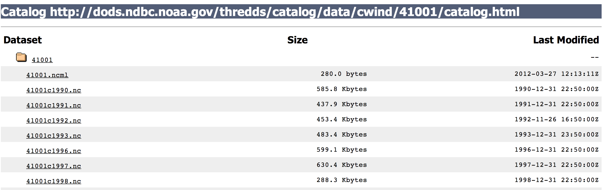

<!--
%\VignetteEngine{knitr::knitr}
%\VignetteIndexEntry{buoy vignette}
-->

```{r echo=FALSE}
opts_chunk$set(message=FALSE, warning=FALSE)
```

buoy vignette
======

This vignette covers NOAA buoy data from the National Buoy Data Center. The
main function is `buoy`, but there are a variety of helper functions that
are used in `buoy` that you can also use. `buoy_buoys` can be used to
get the buoy IDs and web pages for each buoy. `buoy_files` gives the available
files for a given buoy. `buoy_single_file_url` constructs the URL that is used to
get the actual file from the web. `get_ncdf_file` downloads a single ncdf file.
`buoy_collect_data` collects data and makes a `data.frame` from a local ncdf file.

### Install `rnoaa`

Install and load `rnoaa` into the R session.

```{r install, eval=FALSE}
install.packages("devtools")
library(devtools)
ropensci::install_github("ropensci/rnoaa")
```

```{r load}
library('rnoaa')
```

### Find out what stations are available in a dataset

```{r}
buoys <- buoy_buoys(dataset = "cwind")
```

This function uses `cat` to print out the available buoy ids so you can quickly skim and find the one you want and then proceed, or you can inspect further the buoy ids, and the urls for them

```{r}
buoys[1:2]
```

Or browse them on the web

```{r eval=FALSE}
browseURL(buoys[[1]])
```




### Find out what files are available for a single buoy

```{r}
files <- buoy_files(buoys[[1]], 41001)
```

As the previous function, this one prints what files are available, and returns a character string of the file names. Note that for each of these, the letters at the beginning are the data types, and the numbers afterwards are the years, and the `.nc` at the end is the file extension (meaning NCDF). 

```{r}
files
files[[1]]
```


### Get a single ncdf file

Using the last function `buoy_files` gives us file names. Using those and the function `buoy_single_file_url` will give us the full URL to get a single NCDF file. Then we can use `get_ncdf_file` to download the file.

```{r}
url <- buoy_single_file_url(dataset = "cwind", buoyid = 41001, file = files[[1]])
filepath <- get_ncdf_file(path = url, buoyid = 41001, file = files[[1]], output = "~")
```


### Read in NCDF buoy data to a data.frame

```{r}
buoy_collect_data(filepath)
```


### Bring it all together

The above functions are all wrapped up into a single function, `buoy`. You can use each function as you like to construct your perfect workflow, or use `buoy` to do everything for you.  Right now, `buoy` gets the first year of data, but this will be flexible via parameters soon. 

```{r}
buoy(dataset = 'cwind', buoyid = 41001)
```