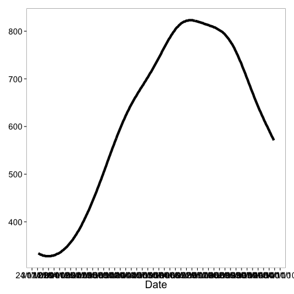
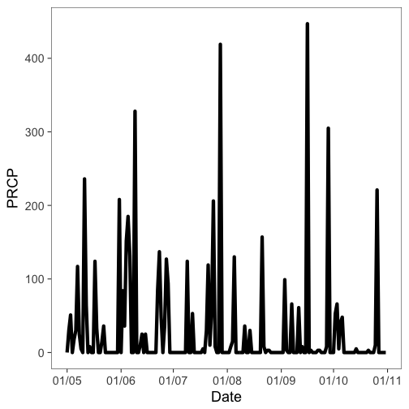
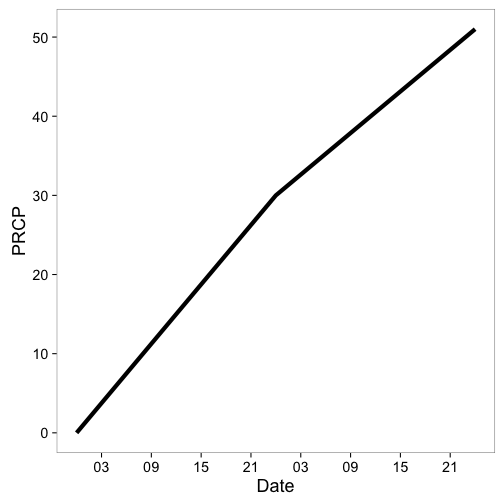
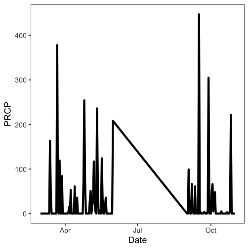
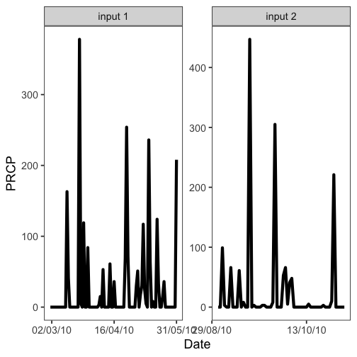

<!--
%\VignetteEngine{knitr::knitr}
%\VignetteIndexEntry{ncdc vignette}
%\VignetteEncoding{UTF-8}
-->


NCDC vignette
======

## About the package

`rnoaa` is an R wrapper for many NOAA data types, including National Climatic Data Center (NCDC).

## Load rnoaa


```r
library('rnoaa')
library('plyr')
```

## Get info on a station by specifying a datasetid, locationid, and stationid


```r
ncdc_stations(datasetid='GHCND', locationid='FIPS:12017', stationid='GHCND:USC00084289')
#> $meta
#> NULL
#> 
#> $data
#>   elevation    mindate    maxdate latitude                  name
#> 1      17.7 1899-02-01 2019-09-09 28.80286 INVERNESS 3 SE, FL US
#>   datacoverage                id elevationUnit longitude
#> 1            1 GHCND:USC00084289        METERS -82.31266
#> 
#> attr(,"class")
#> [1] "ncdc_stations"
```

## Search for data and get a data.frame


```r
out <- ncdc(datasetid='NORMAL_DLY', datatypeid='dly-tmax-normal', startdate = '2010-05-01', enddate = '2010-05-10')
out$data
#> # A tibble: 25 x 5
#>    date                datatype        station           value fl_c 
#>    <chr>               <chr>           <chr>             <int> <chr>
#>  1 2010-05-01T00:00:00 DLY-TMAX-NORMAL GHCND:AQW00061705   869 C    
#>  2 2010-05-01T00:00:00 DLY-TMAX-NORMAL GHCND:CAW00064757   607 Q    
#>  3 2010-05-01T00:00:00 DLY-TMAX-NORMAL GHCND:CQC00914080   840 R    
#>  4 2010-05-01T00:00:00 DLY-TMAX-NORMAL GHCND:CQC00914801   858 R    
#>  5 2010-05-01T00:00:00 DLY-TMAX-NORMAL GHCND:FMC00914395   876 P    
#>  6 2010-05-01T00:00:00 DLY-TMAX-NORMAL GHCND:FMC00914419   885 P    
#>  7 2010-05-01T00:00:00 DLY-TMAX-NORMAL GHCND:FMC00914446   885 P    
#>  8 2010-05-01T00:00:00 DLY-TMAX-NORMAL GHCND:FMC00914482   868 R    
#>  9 2010-05-01T00:00:00 DLY-TMAX-NORMAL GHCND:FMC00914720   899 R    
#> 10 2010-05-01T00:00:00 DLY-TMAX-NORMAL GHCND:FMC00914761   897 P    
#> # … with 15 more rows
```

Note that the `value` column has strangely large numbers for temperature measurements.
By convention, `rnoaa` doesn't do any conversion of values from the APIs and some APIs use seemingly odd units.

You have two options here:

1. Use the `add_units` parameter on `ncdc()` to have `rnoaa` attempt to look up the units. This is a good idea to try first.

2. Consult the documentation for whiechever dataset you're accessing. In this case, `GHCND` has a [README](https://www1.ncdc.noaa.gov/pub/data/ghcn/daily/readme.txt) which indicates `TMAX` is measured in tenths of degrees Celcius.

### See a `data.frame` with units

As mentioned above, you can use the `add_units` parameter with `ncdc()` to ask `rnoaa` to attempt to look up units for whatever data you ask it to return.
Let's ask `rnoaa` to add units to some precipitation (PRCP) data:


```r
with_units <- ncdc(datasetid='GHCND', stationid='GHCND:USW00014895', datatypeid='PRCP', startdate = '2010-05-01', enddate = '2010-10-31', limit=500, add_units = TRUE)
head( with_units$data )
#> # A tibble: 6 x 9
#>   date          datatype station      value fl_m  fl_q  fl_so fl_t  units  
#>   <chr>         <chr>    <chr>        <int> <chr> <chr> <chr> <chr> <chr>  
#> 1 2010-05-01T0… PRCP     GHCND:USW00…     0 T     ""    0     2400  mm_ten…
#> 2 2010-05-02T0… PRCP     GHCND:USW00…    30 ""    ""    0     2400  mm_ten…
#> 3 2010-05-03T0… PRCP     GHCND:USW00…    51 ""    ""    0     2400  mm_ten…
#> 4 2010-05-04T0… PRCP     GHCND:USW00…     0 T     ""    0     2400  mm_ten…
#> 5 2010-05-05T0… PRCP     GHCND:USW00…    18 ""    ""    0     2400  mm_ten…
#> 6 2010-05-06T0… PRCP     GHCND:USW00…    30 ""    ""    0     2400  mm_ten…
```
From the above output, we can see that the units for `PRCP` values are "mm_tenths" which means tenths of a millimeter.
You won't always be so lucky and sometimes you will have to look up the documentation on your own.

## Plot data, super simple, but it's a start


```r
out <- ncdc(datasetid='NORMAL_DLY', stationid='GHCND:USW00014895', datatypeid='dly-tmax-normal', startdate = '2010-01-01', enddate = '2010-12-10', limit = 300)
ncdc_plot(out)
```



Note that `PRCP` values are in units of tenths of a millimeter, as we found out above.

## More on plotting

### Example 1

Search for data first, then plot


```r
out <- ncdc(datasetid='GHCND', stationid='GHCND:USW00014895', datatypeid='PRCP', startdate = '2010-05-01', enddate = '2010-10-31', limit=500)
```

Default plot


```r
ncdc_plot(out)
```


Create 14 day breaks


```r
ncdc_plot(out, breaks="14 days")
```


One month breaks


```r
ncdc_plot(out, breaks="1 month", dateformat="%d/%m")
```



### Example 2

Search for data


```r
out <- ncdc(datasetid='GHCND', stationid='GHCND:USW00014895', datatypeid='PRCP',
            startdate = '2010-05-01', enddate = '2010-10-31', limit=500)
```

Make a plot, with 6 hour breaks, and date format with only hour


```r
ncdc_plot(out, breaks = "1 month", dateformat = "%d/%m")
```



## Combine many calls to noaa function

Search for two sets of data


```r
out1 <- ncdc(datasetid='GHCND', stationid='GHCND:USW00014895', datatypeid='PRCP', startdate = '2010-03-01', enddate = '2010-05-31', limit=500)

out2 <- ncdc(datasetid='GHCND', stationid='GHCND:USW00014895', datatypeid='PRCP', startdate = '2010-09-01', enddate = '2010-10-31', limit=500)
```

Then combine with a call to `ncdc_combine`


```r
df <- ncdc_combine(out1, out2)
head(df[[1]]); tail(df[[1]])
#> # A tibble: 6 x 8
#>   date               datatype station         value fl_m  fl_q  fl_so fl_t 
#>   <chr>              <chr>    <chr>           <int> <chr> <chr> <chr> <chr>
#> 1 2010-03-01T00:00:… PRCP     GHCND:USW00014…     0 T     ""    0     2400 
#> 2 2010-03-02T00:00:… PRCP     GHCND:USW00014…     0 T     ""    0     2400 
#> 3 2010-03-03T00:00:… PRCP     GHCND:USW00014…     0 T     ""    0     2400 
#> 4 2010-03-04T00:00:… PRCP     GHCND:USW00014…     0 ""    ""    0     2400 
#> 5 2010-03-05T00:00:… PRCP     GHCND:USW00014…     0 ""    ""    0     2400 
#> 6 2010-03-06T00:00:… PRCP     GHCND:USW00014…     0 ""    ""    0     2400
#> # A tibble: 6 x 8
#>   date               datatype station         value fl_m  fl_q  fl_so fl_t 
#>   <chr>              <chr>    <chr>           <int> <chr> <chr> <chr> <chr>
#> 1 2010-10-26T00:00:… PRCP     GHCND:USW00014…   221 ""    ""    0     2400 
#> 2 2010-10-27T00:00:… PRCP     GHCND:USW00014…     0 ""    ""    0     2400 
#> 3 2010-10-28T00:00:… PRCP     GHCND:USW00014…     0 T     ""    0     2400 
#> 4 2010-10-29T00:00:… PRCP     GHCND:USW00014…     0 T     ""    0     2400 
#> 5 2010-10-30T00:00:… PRCP     GHCND:USW00014…     0 ""    ""    0     2400 
#> 6 2010-10-31T00:00:… PRCP     GHCND:USW00014…     0 ""    ""    0     2400
```

Then plot - the default passing in the combined plot plots the data together. In this case it looks kind of weird since a straight line combines two distant dates.


```r
ncdc_plot(df)
```



But we can pass in each separately, which uses `facet_wrap` in `ggplot2` to plot each set of data in its own panel.


```r
ncdc_plot(out1, out2, breaks="45 days")
```


