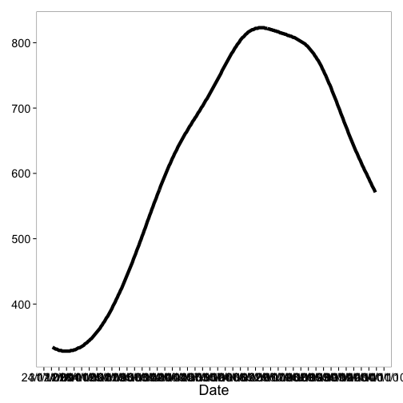
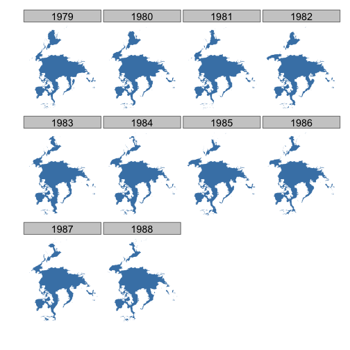
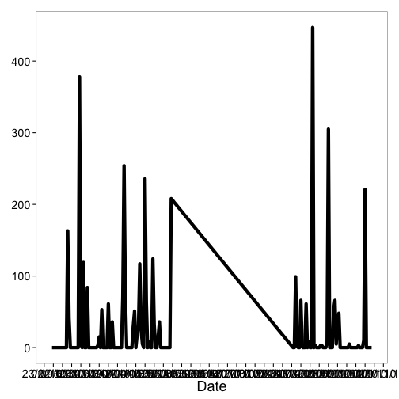
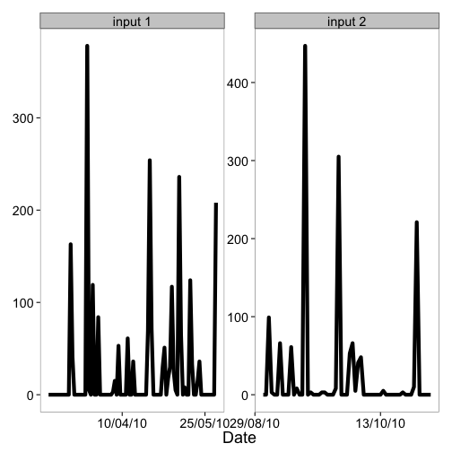

<!--
%\VignetteEngine{knitr::knitr}
%\VignetteIndexEntry{rnoaa vignette}
-->

rnoaa vignette
======

### About the package

`rnoaa` is an R wrapper for the NOAA API.

********************

### Install `rnoaa`

Install and load `rnoaa` into the R session.


```r
install.packages("devtools")
library(devtools)
install_github("rnoaa", "ropensci", ref = "newapi")
```


```r
library(rnoaa)
library(plyr)
```


#### Get info on a station by specifying a datasetid, locationid, and stationid


```r
noaa_stations(datasetid = "GHCND", locationid = "FIPS:12017", stationid = "GHCND:USC00084289")
```

```
## $meta
## NULL
## 
## $data
##                  id                  name datacoverage    mindate
## 1 GHCND:USC00084289 INVERNESS 3 SE, FL US            1 1899-02-01
##      maxdate
## 1 2014-02-26
## 
## attr(,"class")
## [1] "noaa_stations"
```


#### Search for data and get a data.frame or list


```r
out <- noaa(datasetid = "NORMAL_DLY", stationid = "GHCND:USW00014895", datatypeid = "dly-tmax-normal")
```


See a data.frame


```r
out$data
```

```
##              station value attributes        datatype                date
## 1  GHCND:USW00014895   334          S DLY-TMAX-NORMAL 2010-01-01T00:00:00
## 2  GHCND:USW00014895   333          S DLY-TMAX-NORMAL 2010-01-02T00:00:00
## 3  GHCND:USW00014895   332          S DLY-TMAX-NORMAL 2010-01-03T00:00:00
## 4  GHCND:USW00014895   331          S DLY-TMAX-NORMAL 2010-01-04T00:00:00
## 5  GHCND:USW00014895   331          S DLY-TMAX-NORMAL 2010-01-05T00:00:00
## 6  GHCND:USW00014895   330          S DLY-TMAX-NORMAL 2010-01-06T00:00:00
## 7  GHCND:USW00014895   329          S DLY-TMAX-NORMAL 2010-01-07T00:00:00
## 8  GHCND:USW00014895   329          S DLY-TMAX-NORMAL 2010-01-08T00:00:00
## 9  GHCND:USW00014895   329          S DLY-TMAX-NORMAL 2010-01-09T00:00:00
## 10 GHCND:USW00014895   328          S DLY-TMAX-NORMAL 2010-01-10T00:00:00
## 11 GHCND:USW00014895   328          S DLY-TMAX-NORMAL 2010-01-11T00:00:00
## 12 GHCND:USW00014895   328          S DLY-TMAX-NORMAL 2010-01-12T00:00:00
## 13 GHCND:USW00014895   328          S DLY-TMAX-NORMAL 2010-01-13T00:00:00
## 14 GHCND:USW00014895   328          S DLY-TMAX-NORMAL 2010-01-14T00:00:00
## 15 GHCND:USW00014895   328          S DLY-TMAX-NORMAL 2010-01-15T00:00:00
## 16 GHCND:USW00014895   328          S DLY-TMAX-NORMAL 2010-01-16T00:00:00
## 17 GHCND:USW00014895   328          S DLY-TMAX-NORMAL 2010-01-17T00:00:00
## 18 GHCND:USW00014895   329          S DLY-TMAX-NORMAL 2010-01-18T00:00:00
## 19 GHCND:USW00014895   329          S DLY-TMAX-NORMAL 2010-01-19T00:00:00
## 20 GHCND:USW00014895   329          S DLY-TMAX-NORMAL 2010-01-20T00:00:00
## 21 GHCND:USW00014895   330          S DLY-TMAX-NORMAL 2010-01-21T00:00:00
## 22 GHCND:USW00014895   330          S DLY-TMAX-NORMAL 2010-01-22T00:00:00
## 23 GHCND:USW00014895   331          S DLY-TMAX-NORMAL 2010-01-23T00:00:00
## 24 GHCND:USW00014895   332          S DLY-TMAX-NORMAL 2010-01-24T00:00:00
## 25 GHCND:USW00014895   333          S DLY-TMAX-NORMAL 2010-01-25T00:00:00
```


#### Plot data, super simple, but it's a start


```r
out <- noaa(datasetid = "NORMAL_DLY", stationid = "GHCND:USW00014895", datatypeid = "dly-tmax-normal")
noaa_plot(out)
```

 


### More on plotting

#### Example 1

Search for data first, then plot


```r
out <- noaa(datasetid = "GHCND", stationid = "GHCND:USW00014895", datatypeid = "PRCP", 
    startdate = "2010-05-01", enddate = "2010-10-31", limit = 500)
```


Default plot


```r
noaa_plot(out)
```

 


Create 14 day breaks


```r
noaa_plot(out, breaks = "14 days")
```

 


One month breaks


```r
noaa_plot(out, breaks = "1 month", dateformat = "%d/%m")
```

 


#### Example 2

Search for data


```r
out2 <- noaa(datasetid = "GHCND", stationid = "GHCND:USW00014895", datatypeid = "PRCP", 
    startdate = "2010-05-01", enddate = "2010-05-03", limit = 100)
```


Make a plot, with 6 hour breaks, and date format with only hour


```r
noaa_plot(out2, breaks = "6 hours", dateformat = "%H")
```

 


#### Combine many calls to noaa function

Search for two sets of data


```r
out1 <- noaa(datasetid = "GHCND", stationid = "GHCND:USW00014895", datatypeid = "PRCP", 
    startdate = "2010-03-01", enddate = "2010-05-31", limit = 500)

out2 <- noaa(datasetid = "GHCND", stationid = "GHCND:USW00014895", datatypeid = "PRCP", 
    startdate = "2010-09-01", enddate = "2010-10-31", limit = 500)
```


Then combine with a call to `noaa_combine`


```r
df <- noaa_combine(out1, out2)
head(df[[1]])
```

```
##             station value attributes datatype                date
## 1 GHCND:USW00014895     0  T,,0,2400     PRCP 2010-03-01T00:00:00
## 2 GHCND:USW00014895     0  T,,0,2400     PRCP 2010-03-02T00:00:00
## 3 GHCND:USW00014895     0  T,,0,2400     PRCP 2010-03-03T00:00:00
## 4 GHCND:USW00014895     0   ,,0,2400     PRCP 2010-03-04T00:00:00
## 5 GHCND:USW00014895     0   ,,0,2400     PRCP 2010-03-05T00:00:00
## 6 GHCND:USW00014895     0   ,,0,2400     PRCP 2010-03-06T00:00:00
```

```r
tail(df[[1]])
```

```
##               station value attributes datatype                date
## 148 GHCND:USW00014895   221   ,,0,2400     PRCP 2010-10-26T00:00:00
## 149 GHCND:USW00014895     0   ,,0,2400     PRCP 2010-10-27T00:00:00
## 150 GHCND:USW00014895     0  T,,0,2400     PRCP 2010-10-28T00:00:00
## 151 GHCND:USW00014895     0  T,,0,2400     PRCP 2010-10-29T00:00:00
## 152 GHCND:USW00014895     0   ,,0,2400     PRCP 2010-10-30T00:00:00
## 153 GHCND:USW00014895     0   ,,0,2400     PRCP 2010-10-31T00:00:00
```


Then plot - the default passing in the combined plot plots the data together. In this case it looks kind of weird since a straight line combines two distant dates.


```r
noaa_plot(df)
```

 


But we can pass in each separately, which uses `facet_wrap` in `ggplot2` to plot each set of data in its own panel.


```r
noaa_plot(out1, out2, breaks = "45 days")
```

 

