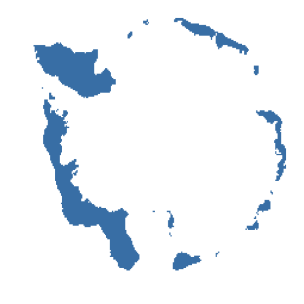
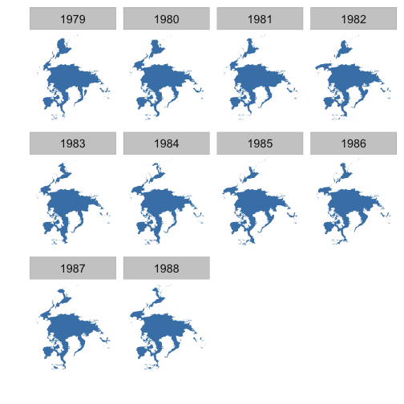

<!--
%\VignetteEngine{knitr::knitr}
%\VignetteIndexEntry{Sea ice vignette}
%\VignetteEncoding{UTF-8}
-->


Sea ice vignette
======

Get sea ice data at <ftp://sidads.colorado.edu/DATASETS/NOAA/G02135/shapefiles>

********************


```r
library('rnoaa')
library('dplyr')
library('ggplot2')
```

### Look at data for a series of years for Feb, South pole


```r
res <- sapply(seq(1986, 1990, 1), function(x) 
    sea_ice(x, month = 'Feb', pole = 'S'))
lapply(res, head)
#> [[1]]
#>      long     lat order  hole piece id group
#> 1 -125000 2250000     1 FALSE     1  0   0.1
#> 2 -100000 2250000     2 FALSE     1  0   0.1
#> 3 -100000 2200000     3 FALSE     1  0   0.1
#> 4 -125000 2200000     4 FALSE     1  0   0.1
#> 5 -125000 2175000     5 FALSE     1  0   0.1
#> 6 -100000 2175000     6 FALSE     1  0   0.1
#> 
#> [[2]]
#>      long     lat order  hole piece id group
#> 1 -100000 2275000     1 FALSE     1  0   0.1
#> 2  -50000 2275000     2 FALSE     1  0   0.1
#> 3  -50000 2200000     3 FALSE     1  0   0.1
#> 4  -75000 2200000     4 FALSE     1  0   0.1
#> 5  -75000 2175000     5 FALSE     1  0   0.1
#> 6 -100000 2175000     6 FALSE     1  0   0.1
#> 
#> [[3]]
#>       long     lat order  hole piece id group
#> 1 -2300000 3475000     1 FALSE     1  0   0.1
#> 2 -2225000 3475000     2 FALSE     1  0   0.1
#> 3 -2225000 3400000     3 FALSE     1  0   0.1
#> 4 -2250000 3400000     4 FALSE     1  0   0.1
#> 5 -2250000 3425000     5 FALSE     1  0   0.1
#> 6 -2300000 3425000     6 FALSE     1  0   0.1
#> 
#> [[4]]
#>      long     lat order  hole piece id group
#> 1 1225000 2025000     1 FALSE     1  0   0.1
#> 2 1250000 2025000     2 FALSE     1  0   0.1
#> 3 1250000 2000000     3 FALSE     1  0   0.1
#> 4 1275000 2000000     4 FALSE     1  0   0.1
#> 5 1275000 1975000     5 FALSE     1  0   0.1
#> 6 1350000 1975000     6 FALSE     1  0   0.1
#> 
#> [[5]]
#>      long     lat order  hole piece id group
#> 1 -150000 2250000     1 FALSE     1  0   0.1
#> 2 -125000 2250000     2 FALSE     1  0   0.1
#> 3 -125000 2225000     3 FALSE     1  0   0.1
#> 4 -150000 2225000     4 FALSE     1  0   0.1
#> 5 -150000 2250000     5 FALSE     1  0   0.1
#> 6  475000 2375000     1 FALSE     1  1   1.1
```

### Map a single year/month/pole combo


```r
ggplot(res[[1]], aes(long, lat, group=group)) +
    geom_polygon(fill="steelblue") +
    theme_ice()
```



### Map all years for April only for North pole


```r
dat <- sea_ice(year = 1985:1990, month = 'Apr', pole = 'N')
df <- bind_rows(dat, .id = "x")
ggplot(df, aes(long, lat, group = group)) +
  geom_polygon(fill = "steelblue") +
  theme_ice() +
  facet_wrap(~ x)
```


