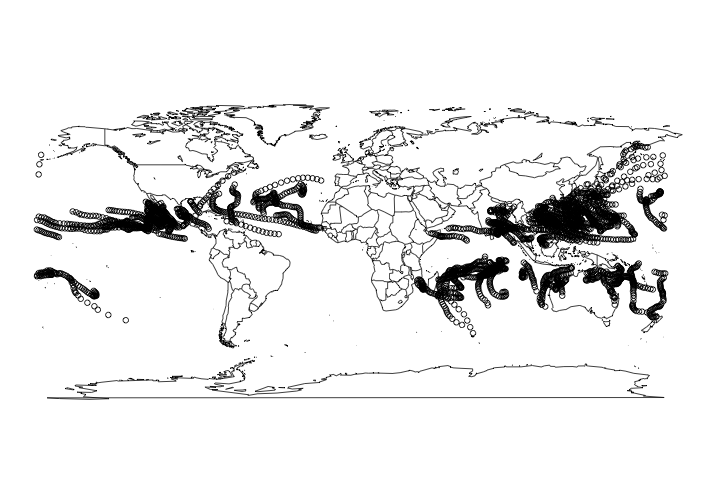

<!--
%\VignetteEngine{knitr::knitr}
%\VignetteIndexEntry{NOAA storms}
%\VignetteEncoding{UTF-8}
-->


NOAA storms data
======

Get NOAA wind storm tabular data, metadata, or shp files from International Best Track Archive for Climate Stewardship (IBTrACS).


Find out more about NOAA storms data at http://www.ncdc.noaa.gov/ibtracs/index.php?name=numbering

## Load rnoaa


```r
library('rnoaa')
```

## Metadata

There are two datasets stored in the package. By default `storm_meta()` gives metadata describing columns of the datasets returned.


```r
head( storm_meta() )
```

```
#>   Column_number Column_name units Shapefile_pt_flag
#> 1             1  Serial_Num   N/A                 1
#> 2             2      Season  Year                 1
#> 3             3         Num     #                 1
#> 4             4       Basin    BB                 1
#> 5             5   Sub_basin    BB                 1
#> 6             6        Name   N/A                 1
#>   Shapefile_pt_attribute_name shapefile_att_type shapefile_att_len
#> 1                  Serial_Num                  7                13
#> 2                      Season                  3                 4
#> 3                         Num                  3                 5
#> 4                       Basin                  7                 3
#> 5                   Sub_basin                  7                 3
#> 6                        Name                  7                57
#>   shapefile_att_prc
#> 1                 0
#> 2                 0
#> 3                 0
#> 4                 0
#> 5                 0
#> 6                 0
```

Or you can get back a dataset of storm names, including storm ids and their names.


```r
head( storm_meta("storm_names") )
```

```
#>              id                name
#> 1 1842298N11080   NOT NAMED(td9636)
#> 2 1845336N10074   NOT NAMED(td9636)
#> 3 1848011S09079   NOT NAMED(td9636)
#> 4 1848011S09080 XXXX848003(reunion)
#> 5 1848011S15057 XXXX848002(reunion)
#> 6 1848011S16057   NOT NAMED(td9636)
```

## Tabular data

You can get tabular data for basins, storms, or years, (or all data). `storm_data()` and the next function `storm_shp()` figure out what files to get, and gets them from an ftp server, and saves them to your machine. Do let us know if you have any problems with paths on your machine, and we'll fix 'em. The result from `storm_data()` is a `dplyr`-like data.frame with a easy summary that makes large datasets easy to view. 

First, by basin (one of EP, NA, NI, SA, SI, SP, or WP)


```r
storm_data(basin='WP')
```

```
#> # A tibble: 39,584 × 195
#>       serial_num season   num basin sub_basin      name
#>            <chr>  <int> <int> <chr>     <chr>     <chr>
#> 1  1884177N17124   1884     1    WP        MM NOT NAMED
#> 2  1884177N17124   1884     1    WP        MM NOT NAMED
#> 3  1884177N17124   1884     1    WP        MM NOT NAMED
#> 4  1884177N17124   1884     1    WP        MM NOT NAMED
#> 5  1884177N17124   1884     1    WP        MM NOT NAMED
#> 6  1884177N17124   1884     1    WP        MM NOT NAMED
#> 7  1884177N17124   1884     1    WP        MM NOT NAMED
#> 8  1884177N17124   1884     1    WP        MM NOT NAMED
#> 9  1884177N17124   1884     1    WP        MM NOT NAMED
#> 10 1884177N17124   1884     1    WP        MM NOT NAMED
#> # ... with 39,574 more rows, and 189 more variables: iso_time <chr>,
#> #   nature <chr>, latitude <dbl>, longitude <dbl>, wind.wmo. <dbl>,
#> #   pres.wmo. <dbl>, center <chr>, wind.wmo..percentile <dbl>,
#> #   pres.wmo..percentile <dbl>, track_type <chr>,
#> #   latitude_for_mapping <dbl>, longitude_for_mapping <dbl>,
#> #   current.basin <chr>, hurdat_atl_lat <dbl>, hurdat_atl_lon <dbl>,
#> #   hurdat_atl_grade <dbl>, hurdat_atl_wind <dbl>, hurdat_atl_pres <dbl>,
#> #   td9636_lat <dbl>, td9636_lon <dbl>, td9636_grade <dbl>,
#> #   td9636_wind <dbl>, td9636_pres <dbl>, reunion_lat <dbl>,
#> #   reunion_lon <dbl>, reunion_grade <dbl>, reunion_wind <dbl>,
#> #   reunion_pres <dbl>, atcf_lat <dbl>, atcf_lon <dbl>, atcf_grade <dbl>,
#> #   atcf_wind <dbl>, atcf_pres <dbl>, ds824_sh_lat <dbl>,
#> #   ds824_sh_lon <dbl>, ds824_sh_grade <dbl>, ds824_sh_wind <dbl>,
#> #   ds824_sh_pres <dbl>, ds824_ni_lat <dbl>, ds824_ni_lon <dbl>,
#> #   ds824_ni_grade <dbl>, ds824_ni_wind <dbl>, ds824_ni_pres <dbl>,
#> #   bom_lat <dbl>, bom_lon <dbl>, bom_grade <dbl>, bom_wind <dbl>,
#> #   bom_pres <dbl>, ds824_au_lat <dbl>, ds824_au_lon <dbl>,
#> #   ds824_au_grade <dbl>, ds824_au_wind <dbl>, ds824_au_pres <dbl>,
#> #   jtwc_sh_lat <dbl>, jtwc_sh_lon <dbl>, jtwc_sh_grade <dbl>,
#> #   jtwc_sh_wind <dbl>, jtwc_sh_pres <dbl>, jtwc_wp_lat <dbl>,
#> #   jtwc_wp_lon <dbl>, jtwc_wp_grade <dbl>, jtwc_wp_wind <dbl>,
#> #   jtwc_wp_pres <dbl>, td9635_lat <dbl>, td9635_lon <dbl>,
#> #   td9635_grade <dbl>, td9635_wind <dbl>, td9635_pres <dbl>,
#> #   ds824_wp_lat <dbl>, ds824_wp_lon <dbl>, ds824_wp_grade <dbl>,
#> #   ds824_wp_wind <dbl>, ds824_wp_pres <dbl>, jtwc_io_lat <dbl>,
#> #   jtwc_io_lon <dbl>, jtwc_io_grade <dbl>, jtwc_io_wind <dbl>,
#> #   jtwc_io_pres <dbl>, cma_lat <dbl>, cma_lon <dbl>, cma_grade <dbl>,
#> #   cma_wind <dbl>, cma_pres <dbl>, hurdat_epa_lat <dbl>,
#> #   hurdat_epa_lon <dbl>, hurdat_epa_grade <dbl>, hurdat_epa_wind <dbl>,
#> #   hurdat_epa_pres <dbl>, jtwc_ep_lat <dbl>, jtwc_ep_lon <dbl>,
#> #   jtwc_ep_grade <dbl>, jtwc_ep_wind <dbl>, jtwc_ep_pres <dbl>,
#> #   ds824_ep_lat <dbl>, ds824_ep_lon <dbl>, ds824_ep_grade <dbl>,
#> #   ds824_ep_wind <dbl>, ds824_ep_pres <dbl>, jtwc_cp_lat <dbl>,
#> #   jtwc_cp_lon <dbl>, ...
```

Or by storm id, see `storm_meta('storm_names')` for storm ids and their names.


```r
storm_data(storm='1970143N19091')
```

```
#> # A tibble: 5 × 195
#>      serial_num season   num basin sub_basin  name            iso_time
#>           <chr>  <int> <int> <chr>     <chr> <chr>               <chr>
#> 1 1970143N19091   1970     2    NI        BB   02B 1970-05-22 18:00:00
#> 2 1970143N19091   1970     2    NI        BB   02B 1970-05-23 00:00:00
#> 3 1970143N19091   1970     2    NI        BB   02B 1970-05-23 06:00:00
#> 4 1970143N19091   1970     2    NI        BB   02B 1970-05-23 12:00:00
#> 5 1970143N19091   1970     2    NI        BB   02B 1970-05-23 18:00:00
#> # ... with 188 more variables: nature <chr>, latitude <dbl>,
#> #   longitude <dbl>, wind.wmo. <dbl>, pres.wmo. <dbl>, center <chr>,
#> #   wind.wmo..percentile <dbl>, pres.wmo..percentile <dbl>,
#> #   track_type <chr>, latitude_for_mapping <dbl>,
#> #   longitude_for_mapping <dbl>, current.basin <chr>,
#> #   hurdat_atl_lat <dbl>, hurdat_atl_lon <dbl>, hurdat_atl_grade <dbl>,
#> #   hurdat_atl_wind <dbl>, hurdat_atl_pres <dbl>, td9636_lat <dbl>,
#> #   td9636_lon <dbl>, td9636_grade <dbl>, td9636_wind <dbl>,
#> #   td9636_pres <dbl>, reunion_lat <dbl>, reunion_lon <dbl>,
#> #   reunion_grade <dbl>, reunion_wind <dbl>, reunion_pres <dbl>,
#> #   atcf_lat <dbl>, atcf_lon <dbl>, atcf_grade <dbl>, atcf_wind <dbl>,
#> #   atcf_pres <dbl>, ds824_sh_lat <dbl>, ds824_sh_lon <dbl>,
#> #   ds824_sh_grade <dbl>, ds824_sh_wind <dbl>, ds824_sh_pres <dbl>,
#> #   ds824_ni_lat <dbl>, ds824_ni_lon <dbl>, ds824_ni_grade <dbl>,
#> #   ds824_ni_wind <dbl>, ds824_ni_pres <dbl>, bom_lat <dbl>,
#> #   bom_lon <dbl>, bom_grade <dbl>, bom_wind <dbl>, bom_pres <dbl>,
#> #   ds824_au_lat <dbl>, ds824_au_lon <dbl>, ds824_au_grade <dbl>,
#> #   ds824_au_wind <dbl>, ds824_au_pres <dbl>, jtwc_sh_lat <dbl>,
#> #   jtwc_sh_lon <dbl>, jtwc_sh_grade <dbl>, jtwc_sh_wind <dbl>,
#> #   jtwc_sh_pres <dbl>, jtwc_wp_lat <dbl>, jtwc_wp_lon <dbl>,
#> #   jtwc_wp_grade <dbl>, jtwc_wp_wind <dbl>, jtwc_wp_pres <dbl>,
#> #   td9635_lat <dbl>, td9635_lon <dbl>, td9635_grade <dbl>,
#> #   td9635_wind <dbl>, td9635_pres <dbl>, ds824_wp_lat <dbl>,
#> #   ds824_wp_lon <dbl>, ds824_wp_grade <dbl>, ds824_wp_wind <dbl>,
#> #   ds824_wp_pres <dbl>, jtwc_io_lat <dbl>, jtwc_io_lon <dbl>,
#> #   jtwc_io_grade <dbl>, jtwc_io_wind <dbl>, jtwc_io_pres <dbl>,
#> #   cma_lat <dbl>, cma_lon <dbl>, cma_grade <dbl>, cma_wind <dbl>,
#> #   cma_pres <dbl>, hurdat_epa_lat <dbl>, hurdat_epa_lon <dbl>,
#> #   hurdat_epa_grade <dbl>, hurdat_epa_wind <dbl>, hurdat_epa_pres <dbl>,
#> #   jtwc_ep_lat <dbl>, jtwc_ep_lon <dbl>, jtwc_ep_grade <dbl>,
#> #   jtwc_ep_wind <dbl>, jtwc_ep_pres <dbl>, ds824_ep_lat <dbl>,
#> #   ds824_ep_lon <dbl>, ds824_ep_grade <dbl>, ds824_ep_wind <dbl>,
#> #   ds824_ep_pres <dbl>, jtwc_cp_lat <dbl>, jtwc_cp_lon <dbl>,
#> #   jtwc_cp_grade <dbl>, ...
```

Or by year, from 1842 to 2014.


```r
storm_data(year=1941)
```

```
#> # A tibble: 1,766 × 195
#>       serial_num season   num basin sub_basin      name
#>            <chr>  <int> <int> <chr>     <chr>     <chr>
#> 1  1940215S18149   1941     1    SP        EA NOT NAMED
#> 2  1940215S18149   1941     1    SP        EA NOT NAMED
#> 3  1940215S18149   1941     1    SP        EA NOT NAMED
#> 4  1940215S18149   1941     1    SP        EA NOT NAMED
#> 5  1940215S18149   1941     1    SP        EA NOT NAMED
#> 6  1940215S18149   1941     1    SP        EA NOT NAMED
#> 7  1940215S18149   1941     1    SP        EA NOT NAMED
#> 8  1940215S18149   1941     1    SP        EA NOT NAMED
#> 9  1940215S18149   1941     1    SP        EA NOT NAMED
#> 10 1940215S18149   1941     1    SP        EA NOT NAMED
#> # ... with 1,756 more rows, and 189 more variables: iso_time <chr>,
#> #   nature <chr>, latitude <dbl>, longitude <dbl>, wind.wmo. <dbl>,
#> #   pres.wmo. <dbl>, center <chr>, wind.wmo..percentile <dbl>,
#> #   pres.wmo..percentile <dbl>, track_type <chr>,
#> #   latitude_for_mapping <dbl>, longitude_for_mapping <dbl>,
#> #   current.basin <chr>, hurdat_atl_lat <dbl>, hurdat_atl_lon <dbl>,
#> #   hurdat_atl_grade <dbl>, hurdat_atl_wind <dbl>, hurdat_atl_pres <dbl>,
#> #   td9636_lat <dbl>, td9636_lon <dbl>, td9636_grade <dbl>,
#> #   td9636_wind <dbl>, td9636_pres <dbl>, reunion_lat <dbl>,
#> #   reunion_lon <dbl>, reunion_grade <dbl>, reunion_wind <dbl>,
#> #   reunion_pres <dbl>, atcf_lat <dbl>, atcf_lon <dbl>, atcf_grade <dbl>,
#> #   atcf_wind <dbl>, atcf_pres <dbl>, ds824_sh_lat <dbl>,
#> #   ds824_sh_lon <dbl>, ds824_sh_grade <dbl>, ds824_sh_wind <dbl>,
#> #   ds824_sh_pres <dbl>, ds824_ni_lat <dbl>, ds824_ni_lon <dbl>,
#> #   ds824_ni_grade <dbl>, ds824_ni_wind <dbl>, ds824_ni_pres <dbl>,
#> #   bom_lat <dbl>, bom_lon <dbl>, bom_grade <dbl>, bom_wind <dbl>,
#> #   bom_pres <dbl>, ds824_au_lat <dbl>, ds824_au_lon <dbl>,
#> #   ds824_au_grade <dbl>, ds824_au_wind <dbl>, ds824_au_pres <dbl>,
#> #   jtwc_sh_lat <dbl>, jtwc_sh_lon <dbl>, jtwc_sh_grade <dbl>,
#> #   jtwc_sh_wind <dbl>, jtwc_sh_pres <dbl>, jtwc_wp_lat <dbl>,
#> #   jtwc_wp_lon <dbl>, jtwc_wp_grade <dbl>, jtwc_wp_wind <dbl>,
#> #   jtwc_wp_pres <dbl>, td9635_lat <dbl>, td9635_lon <dbl>,
#> #   td9635_grade <dbl>, td9635_wind <dbl>, td9635_pres <dbl>,
#> #   ds824_wp_lat <dbl>, ds824_wp_lon <dbl>, ds824_wp_grade <dbl>,
#> #   ds824_wp_wind <dbl>, ds824_wp_pres <dbl>, jtwc_io_lat <dbl>,
#> #   jtwc_io_lon <dbl>, jtwc_io_grade <dbl>, jtwc_io_wind <dbl>,
#> #   jtwc_io_pres <dbl>, cma_lat <dbl>, cma_lon <dbl>, cma_grade <dbl>,
#> #   cma_wind <dbl>, cma_pres <dbl>, hurdat_epa_lat <dbl>,
#> #   hurdat_epa_lon <dbl>, hurdat_epa_grade <dbl>, hurdat_epa_wind <dbl>,
#> #   hurdat_epa_pres <dbl>, jtwc_ep_lat <dbl>, jtwc_ep_lon <dbl>,
#> #   jtwc_ep_grade <dbl>, jtwc_ep_wind <dbl>, jtwc_ep_pres <dbl>,
#> #   ds824_ep_lat <dbl>, ds824_ep_lon <dbl>, ds824_ep_grade <dbl>,
#> #   ds824_ep_wind <dbl>, ds824_ep_pres <dbl>, jtwc_cp_lat <dbl>,
#> #   jtwc_cp_lon <dbl>, ...
```

## shp files

The result from `storm_shp()` is the path, and some metadata, for the shp files downloaded. You can read in the shp files separately with `storm_shp_read()`. 


```r
(res <- storm_shp(year=2013))
```

```
#> <NOAA Storm Shp Files>
#> Path: /Users/sacmac/Library/Caches/rnoaa/storms/year/Year.2013.ibtracs_all_points.v03r06.shp
#> Basin: <NA>
#> Storm: <NA>
#> Year: 2013
#> Type: points
```

You can easily read in the data (or do it on your own), then do stuff with the data, like make a simple plot. 


```r
resshp <- storm_shp_read(res)
library("maps")
map()
points(resshp)
```


