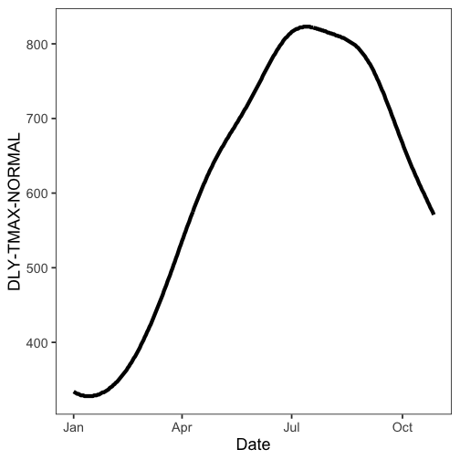
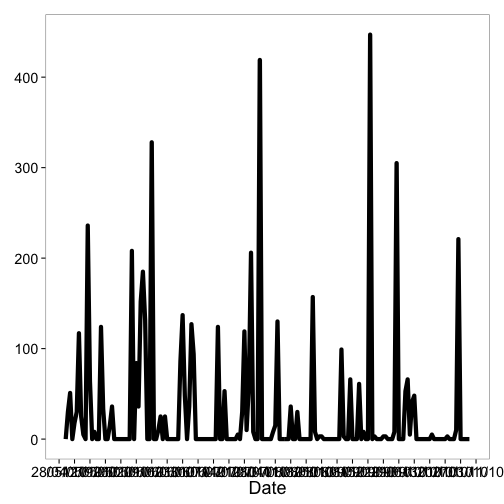
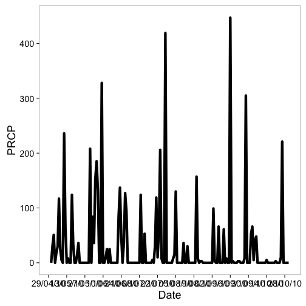
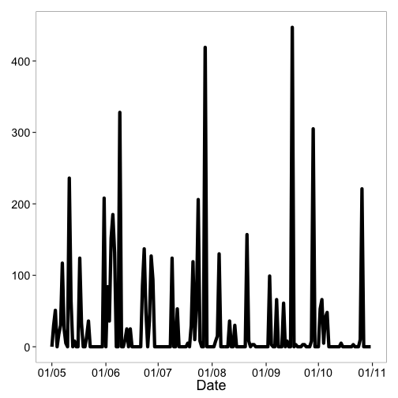
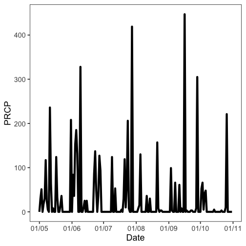
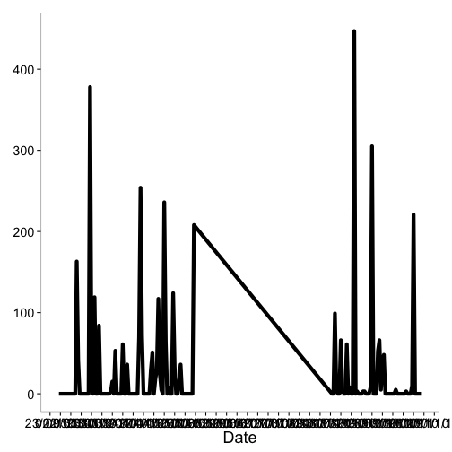
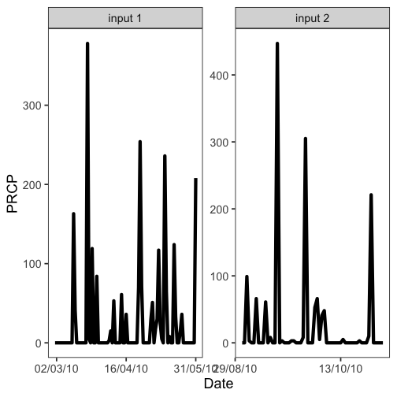

<!--
%\VignetteEngine{knitr::knitr}
%\VignetteIndexEntry{ncdc vignette}
%\VignetteEncoding{UTF-8}
-->


NCDC vignette
======

## About the package

`rnoaa` is an R wrapper for many NOAA data types, including National Climatic Data Center (NCDC).

## Load rnoaa


```r
library('rnoaa')
library('plyr')
```

## Get info on a station by specifying a datasetid, locationid, and stationid


```r
ncdc_stations(datasetid='GHCND', locationid='FIPS:12017', stationid='GHCND:USC00084289')
#> $meta
#> NULL
#> 
#> $data
#>   elevation    mindate    maxdate latitude                  name
#> 1      12.2 1899-02-01 2015-06-16  28.8029 INVERNESS 3 SE, FL US
#>   datacoverage                id elevationUnit longitude
#> 1            1 GHCND:USC00084289        METERS  -82.3126
#> 
#> attr(,"class")
#> [1] "ncdc_stations"
```

## Search for data and get a data.frame


```r
out <- ncdc(datasetid='NORMAL_DLY', datatypeid='dly-tmax-normal', startdate = '2010-05-01', enddate = '2010-05-10')
out$data
#>                   date        datatype           station value fl_c
#> 1  2010-05-01T00:00:00 DLY-TMAX-NORMAL GHCND:AQW00061705   869    C
#> 2  2010-05-01T00:00:00 DLY-TMAX-NORMAL GHCND:CAW00064757   607    Q
#> 3  2010-05-01T00:00:00 DLY-TMAX-NORMAL GHCND:CQC00914080   840    R
#> 4  2010-05-01T00:00:00 DLY-TMAX-NORMAL GHCND:CQC00914801   858    R
#> 5  2010-05-01T00:00:00 DLY-TMAX-NORMAL GHCND:FMC00914395   876    P
#> 6  2010-05-01T00:00:00 DLY-TMAX-NORMAL GHCND:FMC00914419   885    P
#> 7  2010-05-01T00:00:00 DLY-TMAX-NORMAL GHCND:FMC00914446   885    P
#> 8  2010-05-01T00:00:00 DLY-TMAX-NORMAL GHCND:FMC00914482   868    R
#> 9  2010-05-01T00:00:00 DLY-TMAX-NORMAL GHCND:FMC00914720   899    R
#> 10 2010-05-01T00:00:00 DLY-TMAX-NORMAL GHCND:FMC00914761   897    P
#> 11 2010-05-01T00:00:00 DLY-TMAX-NORMAL GHCND:FMC00914831   870    P
#> 12 2010-05-01T00:00:00 DLY-TMAX-NORMAL GHCND:FMC00914892   883    P
#> 13 2010-05-01T00:00:00 DLY-TMAX-NORMAL GHCND:FMC00914898   875    P
#> 14 2010-05-01T00:00:00 DLY-TMAX-NORMAL GHCND:FMC00914911   885    P
#> 15 2010-05-01T00:00:00 DLY-TMAX-NORMAL GHCND:FMW00040308   888    S
#> 16 2010-05-01T00:00:00 DLY-TMAX-NORMAL GHCND:FMW00040504   879    C
#> 17 2010-05-01T00:00:00 DLY-TMAX-NORMAL GHCND:FMW00040505   867    S
#> 18 2010-05-01T00:00:00 DLY-TMAX-NORMAL GHCND:GQC00914025   852    P
#> 19 2010-05-01T00:00:00 DLY-TMAX-NORMAL GHCND:GQW00041415   877    C
#> 20 2010-05-01T00:00:00 DLY-TMAX-NORMAL GHCND:JQW00021603   852    P
#> 21 2010-05-01T00:00:00 DLY-TMAX-NORMAL GHCND:PSC00914519   883    P
#> 22 2010-05-01T00:00:00 DLY-TMAX-NORMAL GHCND:PSC00914712   840    P
#> 23 2010-05-01T00:00:00 DLY-TMAX-NORMAL GHCND:PSW00040309   879    S
#> 24 2010-05-01T00:00:00 DLY-TMAX-NORMAL GHCND:RMW00040604   867    S
#> 25 2010-05-01T00:00:00 DLY-TMAX-NORMAL GHCND:RMW00040710   863    C
```

## Plot data, super simple, but it's a start


```r
out <- ncdc(datasetid='NORMAL_DLY', stationid='GHCND:USW00014895', datatypeid='dly-tmax-normal', startdate = '2010-01-01', enddate = '2010-12-10', limit = 300)
ncdc_plot(out)
```

 

## More on plotting

### Example 1

Search for data first, then plot


```r
out <- ncdc(datasetid='GHCND', stationid='GHCND:USW00014895', datatypeid='PRCP', startdate = '2010-05-01', enddate = '2010-10-31', limit=500)
```

Default plot


```r
ncdc_plot(out)
```



Create 14 day breaks


```r
ncdc_plot(out, breaks="14 days")
```



One month breaks


```r
ncdc_plot(out, breaks="1 month", dateformat="%d/%m")
```



### Example 2

Search for data


```r
out <- ncdc(datasetid='GHCND', stationid='GHCND:USW00014895', datatypeid='PRCP',
            startdate = '2010-05-01', enddate = '2010-10-31', limit=500)
```

Make a plot, with 6 hour breaks, and date format with only hour


```r
ncdc_plot(out, breaks = "1 month", dateformat = "%d/%m")
```



## Combine many calls to noaa function

Search for two sets of data


```r
out1 <- ncdc(datasetid='GHCND', stationid='GHCND:USW00014895', datatypeid='PRCP', startdate = '2010-03-01', enddate = '2010-05-31', limit=500)

out2 <- ncdc(datasetid='GHCND', stationid='GHCND:USW00014895', datatypeid='PRCP', startdate = '2010-09-01', enddate = '2010-10-31', limit=500)
```

Then combine with a call to `ncdc_combine`


```r
df <- ncdc_combine(out1, out2)
head(df[[1]]); tail(df[[1]])
#>                  date datatype           station value fl_m fl_q fl_so
#> 1 2010-03-01T00:00:00     PRCP GHCND:USW00014895     0    T          0
#> 2 2010-03-02T00:00:00     PRCP GHCND:USW00014895     0    T          0
#> 3 2010-03-03T00:00:00     PRCP GHCND:USW00014895     0    T          0
#> 4 2010-03-04T00:00:00     PRCP GHCND:USW00014895     0               0
#> 5 2010-03-05T00:00:00     PRCP GHCND:USW00014895     0               0
#> 6 2010-03-06T00:00:00     PRCP GHCND:USW00014895     0               0
#>   fl_t
#> 1 2400
#> 2 2400
#> 3 2400
#> 4 2400
#> 5 2400
#> 6 2400
#>                    date datatype           station value fl_m fl_q fl_so
#> 148 2010-10-26T00:00:00     PRCP GHCND:USW00014895   221               0
#> 149 2010-10-27T00:00:00     PRCP GHCND:USW00014895     0               0
#> 150 2010-10-28T00:00:00     PRCP GHCND:USW00014895     0    T          0
#> 151 2010-10-29T00:00:00     PRCP GHCND:USW00014895     0    T          0
#> 152 2010-10-30T00:00:00     PRCP GHCND:USW00014895     0               0
#> 153 2010-10-31T00:00:00     PRCP GHCND:USW00014895     0               0
#>     fl_t
#> 148 2400
#> 149 2400
#> 150 2400
#> 151 2400
#> 152 2400
#> 153 2400
```

Then plot - the default passing in the combined plot plots the data together. In this case it looks kind of weird since a straight line combines two distant dates.


```r
ncdc_plot(df)
```



But we can pass in each separately, which uses `facet_wrap` in `ggplot2` to plot each set of data in its own panel.


```r
ncdc_plot(out1, out2, breaks="45 days")
```


