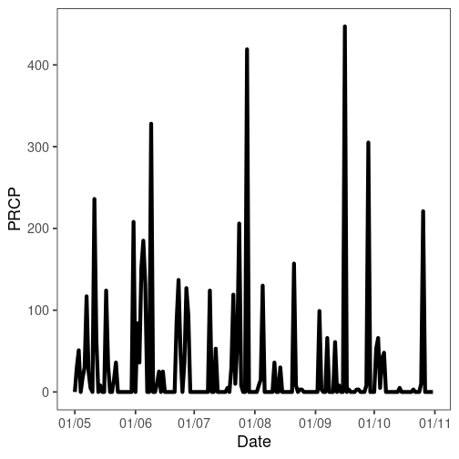
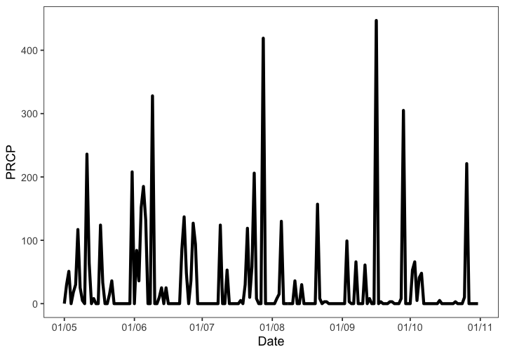
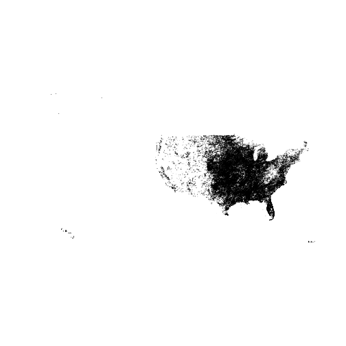

For additional vignettes see https://docs.ropensci.org/rnoaa/

## Installation

__GDAL__

You'll need GDAL (https://gdal.org/) installed first. You may want to use GDAL >= `0.9-1` since that version or later can read TopoJSON format files as well, which aren't required here, but may be useful. Install GDAL:

* OSX - From https://www.kyngchaos.com/software/frameworks/
* Linux - run `sudo apt-get install gdal-bin`
* Windows - From https://trac.osgeo.org/osgeo4w/

Then when you install the R package `rgdal` (`rgeos` also requires GDAL), you'll most likely need to specify where you're `gdal-config` file is on your machine, as well as a few other things. I have an OSX Mavericks machine, and this works for me (there's no binary for Mavericks, so install the source version):


```r
install.packages("https://cran.r-project.org/src/contrib/rgdal_0.9-1.tar.gz", repos = NULL, type="source", configure.args = "--with-gdal-config=/Library/Frameworks/GDAL.framework/Versions/1.10/unix/bin/gdal-config --with-proj-include=/Library/Frameworks/PROJ.framework/unix/include --with-proj-lib=/Library/Frameworks/PROJ.framework/unix/lib")
```

The rest of the installation should be easy. If not, let us know.

__Stable version from CRAN__


```r
install.packages("rnoaa")
```

__or development version from GitHub__


```r
remotes::install_github("ropensci/rnoaa")
```

__Load rnoaa__


```r
library('rnoaa')
```

## NCDC v2 API data

**NCDC Authentication**

You'll need an API key to use the NOAA NCDC functions (those starting with `ncdc*()`) in this package (essentially a password). Go to https://www.ncdc.noaa.gov/cdo-web/token to get one. *You can't use this package without an API key.*

Once you obtain a key, there are two ways to use it.

a) Pass it inline with each function call (somewhat cumbersome)


```r
ncdc(datasetid = 'PRECIP_HLY', locationid = 'ZIP:28801', datatypeid = 'HPCP', startdate = '2013-10-01', enddate = '2013-12-01', limit = 5, token =  "YOUR_TOKEN")
```

b) Alternatively, you might find it easier to set this as an option, either by adding this line to the top of a script or somewhere in your `.rprofile`


```r
options(noaakey = "KEY_EMAILED_TO_YOU")
```

c) You can always store in permamently in your `.Rprofile` file.

###  Fetch list of city locations in descending order


```r
ncdc_locs(locationcategoryid='CITY', sortfield='name', sortorder='desc')
#> $meta
#> $meta$totalCount
#> [1] 1989
#> 
#> $meta$pageCount
#> [1] 25
#> 
#> $meta$offset
#> [1] 1
#> 
#> 
#> $data
#>       mindate    maxdate                  name datacoverage            id
#> 1  1892-08-01 2020-07-31            Zwolle, NL       1.0000 CITY:NL000012
#> 2  1901-01-01 2020-10-02            Zurich, SZ       1.0000 CITY:SZ000007
#> 3  1957-07-01 2020-10-02         Zonguldak, TU       1.0000 CITY:TU000057
#> 4  1906-01-01 2020-10-02            Zinder, NG       0.9025 CITY:NG000004
#> 5  1973-01-01 2020-10-02        Ziguinchor, SG       1.0000 CITY:SG000004
#> 6  1938-01-01 2020-10-02         Zhytomyra, UP       0.9723 CITY:UP000025
#> 7  1948-03-01 2020-10-02        Zhezkazgan, KZ       0.9302 CITY:KZ000017
#> 8  1951-01-01 2020-10-02         Zhengzhou, CH       1.0000 CITY:CH000045
#> 9  1941-01-01 2020-07-31          Zaragoza, SP       1.0000 CITY:SP000021
#> 10 1936-01-01 2009-06-17      Zaporiyhzhya, UP       1.0000 CITY:UP000024
#> 11 1957-01-01 2020-10-02          Zanzibar, TZ       0.8016 CITY:TZ000019
#> 12 1973-01-01 2020-10-02            Zanjan, IR       0.9105 CITY:IR000020
#> 13 1893-01-01 2020-10-04     Zanesville, OH US       1.0000 CITY:US390029
#> 14 1912-01-01 2020-10-02             Zahle, LE       0.9819 CITY:LE000004
#> 15 1951-01-01 2020-10-02           Zahedan, IR       0.9975 CITY:IR000019
#> 16 1860-12-01 2020-10-02            Zagreb, HR       1.0000 CITY:HR000002
#> 17 1929-07-01 2020-09-13         Zacatecas, MX       1.0000 CITY:MX000036
#> 18 1947-01-01 2020-10-02 Yuzhno-Sakhalinsk, RS       1.0000 CITY:RS000081
#> 19 1893-01-01 2020-10-04           Yuma, AZ US       1.0000 CITY:US040015
#> 20 1942-02-01 2020-10-03   Yucca Valley, CA US       1.0000 CITY:US060048
#> 21 1885-01-01 2020-10-04      Yuba City, CA US       1.0000 CITY:US060047
#> 22 1998-02-01 2020-10-02            Yozgat, TU       0.9993 CITY:TU000056
#> 23 1893-01-01 2020-10-04     Youngstown, OH US       1.0000 CITY:US390028
#> 24 1894-01-01 2020-10-04           York, PA US       1.0000 CITY:US420024
#> 25 1869-01-01 2020-10-04        Yonkers, NY US       1.0000 CITY:US360031
#> 
#> attr(,"class")
#> [1] "ncdc_locs"
```

### Get info on a station by specifying a dataset, locationtype, location, and station


```r
ncdc_stations(datasetid='GHCND', locationid='FIPS:12017', stationid='GHCND:USC00084289')
#> $meta
#> NULL
#> 
#> $data
#>   elevation    mindate    maxdate latitude                  name datacoverage
#> 1      17.7 1899-01-01 2020-10-02 28.80286 INVERNESS 3 SE, FL US            1
#>                  id elevationUnit longitude
#> 1 GHCND:USC00084289        METERS -82.31266
#> 
#> attr(,"class")
#> [1] "ncdc_stations"
```


### Search for data


```r
out <- ncdc(datasetid='NORMAL_DLY', stationid='GHCND:USW00014895', datatypeid='dly-tmax-normal', startdate = '2010-05-01', enddate = '2010-05-10')
```

### See a data.frame


```r
head( out$data )
#> # A tibble: 6 x 5
#>   date                datatype        station           value fl_c 
#>   <chr>               <chr>           <chr>             <int> <chr>
#> 1 2010-05-01T00:00:00 DLY-TMAX-NORMAL GHCND:USW00014895   652 S    
#> 2 2010-05-02T00:00:00 DLY-TMAX-NORMAL GHCND:USW00014895   655 S    
#> 3 2010-05-03T00:00:00 DLY-TMAX-NORMAL GHCND:USW00014895   658 S    
#> 4 2010-05-04T00:00:00 DLY-TMAX-NORMAL GHCND:USW00014895   661 S    
#> 5 2010-05-05T00:00:00 DLY-TMAX-NORMAL GHCND:USW00014895   663 S    
#> 6 2010-05-06T00:00:00 DLY-TMAX-NORMAL GHCND:USW00014895   666 S
```

Note that the `value` column has strangely large numbers for temperature measurements.
By convention, `rnoaa` doesn't do any conversion of values from the APIs and some APIs use seemingly odd units.

You have two options here:

1. Use the `add_units` parameter on `ncdc` to have `rnoaa` attempt to look up the units. This is a good idea to try first.

2. Consult the documentation for whiechever dataset you're accessing. In this case, `GHCND` has a README (https://www1.ncdc.noaa.gov/pub/data/ghcn/daily/readme.txt) which indicates `TMAX` is measured in tenths of degrees Celcius.

### See a `data.frame` with units

As mentioned above, you can use the `add_units` parameter with `ncdc()` to ask `rnoaa` to attempt to look up units for whatever data you ask it to return.
Let's ask `rnoaa` to add units to some precipitation (PRCP) data:


```r
with_units <- ncdc(datasetid='GHCND', stationid='GHCND:USW00014895', datatypeid='PRCP', startdate = '2010-05-01', enddate = '2010-10-31', limit=500, add_units = TRUE)
head( with_units$data )
#> # A tibble: 6 x 9
#>   date            datatype station         value fl_m  fl_q  fl_so fl_t  units  
#>   <chr>           <chr>    <chr>           <int> <chr> <chr> <chr> <chr> <chr>  
#> 1 2010-05-01T00:… PRCP     GHCND:USW00014…     0 "T"   ""    0     2400  mm_ten…
#> 2 2010-05-02T00:… PRCP     GHCND:USW00014…    30 ""    ""    0     2400  mm_ten…
#> 3 2010-05-03T00:… PRCP     GHCND:USW00014…    51 ""    ""    0     2400  mm_ten…
#> 4 2010-05-04T00:… PRCP     GHCND:USW00014…     0 "T"   ""    0     2400  mm_ten…
#> 5 2010-05-05T00:… PRCP     GHCND:USW00014…    18 ""    ""    0     2400  mm_ten…
#> 6 2010-05-06T00:… PRCP     GHCND:USW00014…    30 ""    ""    0     2400  mm_ten…
```
From the above output, we can see that the units for `PRCP` values are "mm_tenths" which means tenths of a millimeter.
You won't always be so lucky and sometimes you will have to look up the documentation on your own.

### Plot data, super simple, but it's a start


```r
out <- ncdc(datasetid='GHCND', stationid='GHCND:USW00014895', datatypeid='PRCP', startdate = '2010-05-01', enddate = '2010-10-31', limit=500)
ncdc_plot(out, breaks="1 month", dateformat="%d/%m")
```



Note that `PRCP` values are in units of tenths of a millimeter, as we found out above.

### More plotting

You can pass many outputs from calls to the `noaa` function in to the `ncdc_plot` function.


```r
out1 <- ncdc(datasetid='GHCND', stationid='GHCND:USW00014895', datatypeid='PRCP', startdate = '2010-03-01', enddate = '2010-05-31', limit=500)
out2 <- ncdc(datasetid='GHCND', stationid='GHCND:USW00014895', datatypeid='PRCP', startdate = '2010-09-01', enddate = '2010-10-31', limit=500)
ncdc_plot(out1, out2, breaks="45 days")
```



### Get table of all datasets


```r
ncdc_datasets()
#> $meta
#> $meta$offset
#> [1] 1
#> 
#> $meta$count
#> [1] 11
#> 
#> $meta$limit
#> [1] 25
#> 
#> 
#> $data
#>                     uid    mindate    maxdate                        name
#> 1  gov.noaa.ncdc:C00861 1763-01-01 2020-10-03             Daily Summaries
#> 2  gov.noaa.ncdc:C00946 1763-01-01 2020-09-01 Global Summary of the Month
#> 3  gov.noaa.ncdc:C00947 1763-01-01 2020-01-01  Global Summary of the Year
#> 4  gov.noaa.ncdc:C00345 1991-06-05 2020-10-02    Weather Radar (Level II)
#> 5  gov.noaa.ncdc:C00708 1994-05-20 2020-10-03   Weather Radar (Level III)
#> 6  gov.noaa.ncdc:C00821 2010-01-01 2010-01-01     Normals Annual/Seasonal
#> 7  gov.noaa.ncdc:C00823 2010-01-01 2010-12-31               Normals Daily
#> 8  gov.noaa.ncdc:C00824 2010-01-01 2010-12-31              Normals Hourly
#> 9  gov.noaa.ncdc:C00822 2010-01-01 2010-12-01             Normals Monthly
#> 10 gov.noaa.ncdc:C00505 1970-05-12 2014-01-01     Precipitation 15 Minute
#> 11 gov.noaa.ncdc:C00313 1900-01-01 2014-01-01        Precipitation Hourly
#>    datacoverage         id
#> 1          1.00      GHCND
#> 2          1.00       GSOM
#> 3          1.00       GSOY
#> 4          0.95    NEXRAD2
#> 5          0.95    NEXRAD3
#> 6          1.00 NORMAL_ANN
#> 7          1.00 NORMAL_DLY
#> 8          1.00 NORMAL_HLY
#> 9          1.00 NORMAL_MLY
#> 10         0.25  PRECIP_15
#> 11         1.00 PRECIP_HLY
#> 
#> attr(,"class")
#> [1] "ncdc_datasets"
```

### Get data category data and metadata


```r
ncdc_datacats(locationid = 'CITY:US390029')
#> $meta
#> $meta$totalCount
#> [1] 39
#> 
#> $meta$pageCount
#> [1] 25
#> 
#> $meta$offset
#> [1] 1
#> 
#> 
#> $data
#>                     name            id
#> 1    Annual Agricultural        ANNAGR
#> 2     Annual Degree Days         ANNDD
#> 3   Annual Precipitation       ANNPRCP
#> 4     Annual Temperature       ANNTEMP
#> 5    Autumn Agricultural         AUAGR
#> 6     Autumn Degree Days          AUDD
#> 7   Autumn Precipitation        AUPRCP
#> 8     Autumn Temperature        AUTEMP
#> 9               Computed          COMP
#> 10 Computed Agricultural       COMPAGR
#> 11           Degree Days            DD
#> 12      Dual-Pol Moments DUALPOLMOMENT
#> 13             Echo Tops       ECHOTOP
#> 14      Hydrometeor Type   HYDROMETEOR
#> 15            Miscellany          MISC
#> 16                 Other         OTHER
#> 17               Overlay       OVERLAY
#> 18         Precipitation          PRCP
#> 19          Reflectivity  REFLECTIVITY
#> 20    Sky cover & clouds           SKY
#> 21   Spring Agricultural         SPAGR
#> 22    Spring Degree Days          SPDD
#> 23  Spring Precipitation        SPPRCP
#> 24    Spring Temperature        SPTEMP
#> 25   Summer Agricultural         SUAGR
#> 
#> attr(,"class")
#> [1] "ncdc_datacats"
```

## Tornado data

The function `tornadoes()` simply gets __all the data__. So the call takes a while, but once done, is fun to play with.


```r
shp <- tornadoes()
#> OGR data source with driver: ESRI Shapefile 
#> Source: "/Users/sckott/Library/Caches/R/noaa_tornadoes/1950-2018-torn-aspath", layer: "1950-2018-torn-aspath"
#> with 63645 features
#> It has 22 fields
#> Integer64 fields read as strings:  om yr mo dy tz stf stn mag inj fat wid fc
library('sp')
plot(shp)
```



## HOMR metadata

In this example, search for metadata for a single station ID


```r
homr(qid = 'COOP:046742')
```

## Argo buoys data

There are a suite of functions for Argo data, a few egs:


```r
# Spatial search - by bounding box
argo_search("coord", box = c(-40, 35, 3, 2))

# Time based search
argo_search("coord", yearmin = 2007, yearmax = 2009)

# Data quality based search
argo_search("coord", pres_qc = "A", temp_qc = "A")

# Search on partial float id number
argo_qwmo(qwmo = 49)

# Get data
argo(dac = "meds", id = 4900881, cycle = 127, dtype = "D")
```

## CO-OPS data

Get daily mean water level data at Fairport, OH (9063053)


```r
coops_search(station_name = 9063053, begin_date = 20150927, end_date = 20150928,
             product = "daily_mean", datum = "stnd", time_zone = "lst")
#> $metadata
#> $metadata$id
#> [1] "9063053"
#> 
#> $metadata$name
#> [1] "Fairport"
#> 
#> $metadata$lat
#> [1] "41.7597"
#> 
#> $metadata$lon
#> [1] "-81.2811"
#> 
#> 
#> $data
#>            t       v   f
#> 1 2015-09-27 174.430 0,0
#> 2 2015-09-28 174.422 0,0
```

## Additional vignettes

For additional vignettes see https://docs.ropensci.org/rnoaa/
