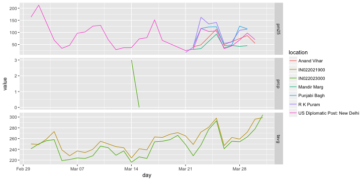

<!--
%\VignetteEngine{knitr::knitr}
%\VignetteIndexEntry{air_quality_and_weather_data}
%\VignetteEncoding{UTF-8}
-->

# Complementing air quality data with weather data using rnoaa

__Author__ Maëlle Salmon

# Introduction: getting air quality data

This vignette aims at explaining how you can complement a data.frame with weather data using rnoaa. In this vignette we shall use air quality data from the OpenAQ platform queried with the ropenaq package, for India. Using [ropenaq](https://github.com/ropensci/ropenaq) one can get e.g. PM2.5 values over time in Delhi in March 2016. For getting all data for march we'll loop over several pages.

First, we need to know how many measures are available for Delhi for March 2016.


```r
library("ropenaq")

measurementsDelhi <- aq_measurements(city = "Delhi", parameter = "pm25",
                                     date_from = "2016-03-01",
                                     date_to = "2016-03-31")

save(measurementsDelhi, file = "data/measurementsDelhi.RData")
```

We filter negative values.


```r
library("dplyr")
load("data/measurementsDelhi.RData")
measurementsDelhi %>% head() %>% knitr::kable()
```


|location                      |parameter | value|unit  |country |city  | latitude| longitude|dateUTC             |dateLocal           |cityURL |locationURL                     |
|:-----------------------------|:---------|-----:|:-----|:-------|:-----|--------:|---------:|:-------------------|:-------------------|:-------|:-------------------------------|
|US Diplomatic Post: New Delhi |pm25      |   127|µg/m³ |IN      |Delhi |  28.5981|  77.18907|2016-03-30 23:30:00 |2016-03-31 05:00:00 |Delhi   |US+Diplomatic+Post%3A+New+Delhi |
|US Diplomatic Post: New Delhi |pm25      |   120|µg/m³ |IN      |Delhi |  28.5981|  77.18907|2016-03-30 22:30:00 |2016-03-31 04:00:00 |Delhi   |US+Diplomatic+Post%3A+New+Delhi |
|US Diplomatic Post: New Delhi |pm25      |   111|µg/m³ |IN      |Delhi |  28.5981|  77.18907|2016-03-30 21:30:00 |2016-03-31 03:00:00 |Delhi   |US+Diplomatic+Post%3A+New+Delhi |
|US Diplomatic Post: New Delhi |pm25      |   116|µg/m³ |IN      |Delhi |  28.5981|  77.18907|2016-03-30 20:30:00 |2016-03-31 02:00:00 |Delhi   |US+Diplomatic+Post%3A+New+Delhi |
|US Diplomatic Post: New Delhi |pm25      |   111|µg/m³ |IN      |Delhi |  28.5981|  77.18907|2016-03-30 19:30:00 |2016-03-31 01:00:00 |Delhi   |US+Diplomatic+Post%3A+New+Delhi |
|US Diplomatic Post: New Delhi |pm25      |   101|µg/m³ |IN      |Delhi |  28.5981|  77.18907|2016-03-30 18:30:00 |2016-03-31 00:00:00 |Delhi   |US+Diplomatic+Post%3A+New+Delhi |

```r
measurementsDelhi <- filter(measurementsDelhi, value > 0)
```

We now transform these data into daily data.


```r
# only keep stations with geographical information
measurementsDelhi <- filter(measurementsDelhi, !is.na(latitude))
# now transform to daily data
measurementsDelhi <- measurementsDelhi %>%
  mutate(day = as.Date(dateLocal)) %>%
  group_by(location, day) %>%
  summarize(value = mean(value),
            longitude = longitude[1],
            latitude = latitude[1]) %>%
  ungroup()
measurementsDelhi %>% head() %>% knitr::kable()
```


|location    |day        |    value| longitude| latitude|
|:-----------|:----------|--------:|---------:|--------:|
|Anand Vihar |2016-03-01 | 258.0000|   77.3152|  28.6508|
|Anand Vihar |2016-03-03 | 148.6000|   77.3152|  28.6508|
|Anand Vihar |2016-03-07 | 112.6667|   77.3152|  28.6508|
|Anand Vihar |2016-03-08 |  57.0000|   77.3152|  28.6508|
|Anand Vihar |2016-03-09 | 111.0000|   77.3152|  28.6508|
|Anand Vihar |2016-03-10 | 125.0000|   77.3152|  28.6508|

Air quality and weather are correlated, so one could be interested in getting a time series of say temperature for the same location. The OpenAQ platform itself does not provide weather data but nearly all stations have geographical coordinates. Our goal here will be to use rnoaa to complement this table with precipitation and temperature.

# Find weather stations

For finding the right station(s) we shall use the `meteo_nearby_stations` function. It returns a list with the weather stations nearby each latitude/longitude given as arguments, respecting the other arguments such as maximal radius, first year with data, etc. For finding stations one might have to play a bit with the parameters until there is at least one station for each location.

Here we query stations with a less than 15km distance from the air quality stations, with precipitation and temperature data, and with data starting from 2016. Note that the query takes a while.


```r
library("rnoaa")
station_data <- ghcnd_stations()
lat_lon_df <- select(measurementsDelhi,
                     location,
                     latitude,
                     longitude) %>% unique() %>%
  ungroup() %>%
  rename(id = location) %>%
  mutate(id = factor(id))

stationsDelhi <- meteo_nearby_stations(lat_lon_df = as.data.frame(lat_lon_df),
                                       station_data = station_data,
                                       radius = 15,
                                       year_min = 2016,
                                       var = c("TAVG", "PRCP"))
stationsDelhi <- unique(bind_rows(stationsDelhi) %>% select(- distance))

save(stationsDelhi, file = "data/stationsDelhi.RData")
```


```r
load("data/stationsDelhi.RData")
stationsDelhi %>% knitr::kable()
```


|id          |name                | latitude| longitude|
|:-----------|:-------------------|--------:|---------:|
|IN022021900 |NEW DELHI/SAFDARJUN |   28.583|    77.200|
|IN022023000 |NEW DELHI/PALAM     |   28.567|    77.117|

Now let us plot the AQ and weather stations on a quick and dirty map with no legend, red for AQ stations, blue for weather stations.

> Not shown


```r
library("ggmap")
map <- get_map(location = "Delhi", zoom = 11)
ggmap(map) +
  geom_point(aes(x = longitude, y = latitude),
             data = stationsDelhi, col = "blue", size = 4)+
  geom_point(aes(x = longitude, y = latitude),
             data = measurementsDelhi, col = "red", size = 4)
```


# Query weather data for these stations

For pulling weather data from these weather monitors, we shall use the `meteo_pull_monitors` function.


```r
library("rnoaa")
monitors <- stationsDelhi$id
all_monitors_clean <- meteo_pull_monitors(monitors,
                                      date_min = "2016-03-01",
                                     date_max = "2016-03-31") %>%
  rename(day = date,
         location = id)
all_monitors_clean %>% head() %>% knitr::kable()
```


|location    |day        | tavg| tmax| tmin| prcp|
|:-----------|:----------|----:|----:|----:|----:|
|IN022021900 |2016-03-01 |  250|  310|  150|   NA|
|IN022021900 |2016-03-02 |  249|   NA|  152|   NA|
|IN022021900 |2016-03-03 |  259|   NA|  157|   NA|
|IN022021900 |2016-03-04 |  273|   NA|  176|   NA|
|IN022021900 |2016-03-05 |  238|  341|   NA|   NA|
|IN022021900 |2016-03-06 |  228|  301|  155|   NA|

Here we notice some values are not available. Therefore, we might need to go back to weather stations searching with, for instance, a larger radius. In this case let's say we're ok with the result of the search.

# Join the two tables, thus complementing the original table

Therefore, in this case we will bind the rows of the air quality table with the weather table.


```r
measurementsDelhi <- bind_rows(measurementsDelhi, all_monitors_clean)
measurementsDelhi %>% head() %>% knitr::kable()
```


|location    |day        |    value| longitude| latitude| tavg| tmax| tmin| prcp|
|:-----------|:----------|--------:|---------:|--------:|----:|----:|----:|----:|
|Anand Vihar |2016-03-01 | 258.0000|   77.3152|  28.6508|   NA|   NA|   NA|   NA|
|Anand Vihar |2016-03-03 | 148.6000|   77.3152|  28.6508|   NA|   NA|   NA|   NA|
|Anand Vihar |2016-03-07 | 112.6667|   77.3152|  28.6508|   NA|   NA|   NA|   NA|
|Anand Vihar |2016-03-08 |  57.0000|   77.3152|  28.6508|   NA|   NA|   NA|   NA|
|Anand Vihar |2016-03-09 | 111.0000|   77.3152|  28.6508|   NA|   NA|   NA|   NA|
|Anand Vihar |2016-03-10 | 125.0000|   77.3152|  28.6508|   NA|   NA|   NA|   NA|


 Now some locations are air quality locations and have only missing values in the weather columns, and some locations are weather locations and have only missing values in the air quality columns.

We can plot the data we got.


```r
data_plot <- measurementsDelhi %>%
  rename(pm25 = value) %>%
  select(- longitude, - latitude, - tmax, - tmin) %>%
  tidyr::gather(parameter, value, pm25:prcp)

library("ggplot2")
ggplot(data_plot) +
  geom_line(aes(x = day, y = value, col = location)) +
  facet_grid(parameter ~ ., scales = "free_y")
```


