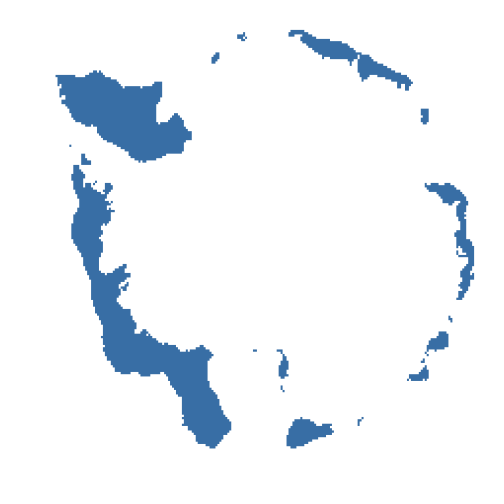
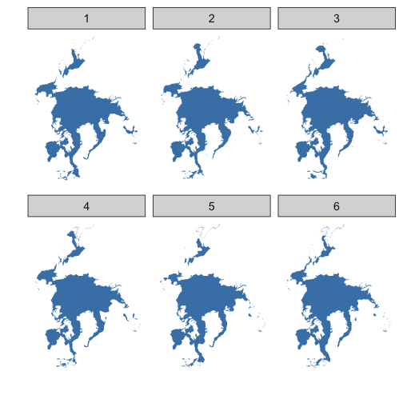

<!--
%\VignetteEngine{knitr::knitr}
%\VignetteIndexEntry{Sea ice vignette}
%\VignetteEncoding{UTF-8}
-->


Sea ice vignette
======

Get sea ice data at [ftp://sidads.colorado.edu/DATASETS/NOAA/G02135/shapefiles](ftp://sidads.colorado.edu/DATASETS/NOAA/G02135/shapefiles).

********************


```r
library('rnoaa')
library('plyr')
```

### Look at data.frame's for a series of years for Feb, South pole


```r
urls <- sapply(seq(1979, 1990, 1), function(x) seaiceeurls(yr = x, mo = 'Feb', pole = 'S'))
out <- lapply(urls, seaice)
head(out[[1]])
#>      long     lat order  hole piece id group
#> 1  650000 2200000     1 FALSE     1  0   0.1
#> 2  675000 2200000     2 FALSE     1  0   0.1
#> 3  675000 2150000     3 FALSE     1  0   0.1
#> 4  650000 2150000     4 FALSE     1  0   0.1
#> 5  650000 2200000     5 FALSE     1  0   0.1
#> 6 -275000 2325000     1 FALSE     1  1   1.1
```

### Map a single year/month/pole combo


```r
urls <- seaiceeurls(mo = 'Apr', pole = 'N', yr = 1990)
out <- seaice(urls)
library('ggplot2')
ggplot(out, aes(long, lat, group = group)) +
   geom_polygon(fill = "steelblue") +
   theme_ice()
```



### Map all years for April only for North pole


```r
urls <- seaiceeurls(mo = 'Apr', pole = 'N')[1:10]
out <- lapply(urls, seaice)
names(out) <- seq(1979, 1988, 1)
df <- ldply(out)
library('ggplot2')
ggplot(df, aes(long, lat, group = group)) +
  geom_polygon(fill = "steelblue") +
  theme_ice() +
  facet_wrap(~.id)
```


